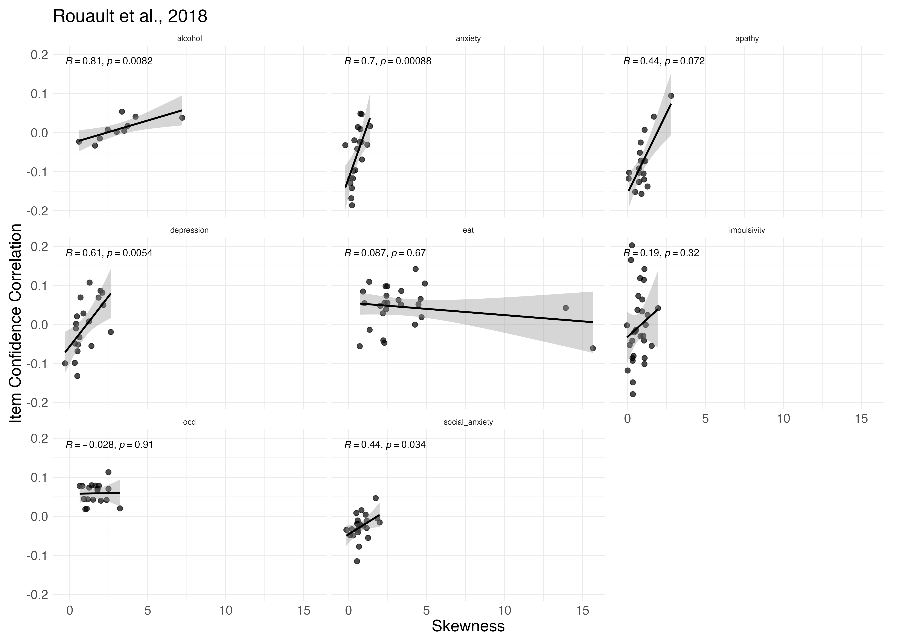
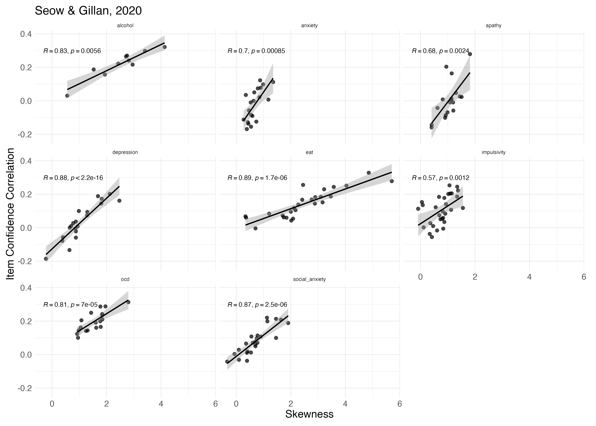
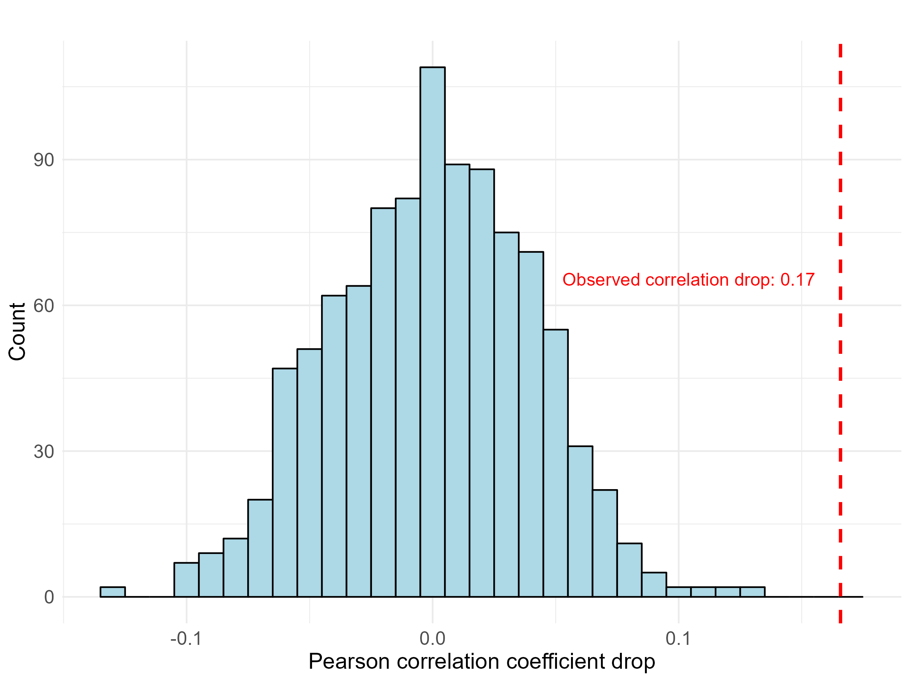

## Supplementary analysis

### Mixed linear model analysis of item reversal effects on item-confidence correlation

In order to control for the possible effect of questionnaire content on the correlation between standard and reversed items with confidence, we performed a linear mixed model predicting item-correlation with confidence from item coding (standard/reversed) with random intercept for questionnaire (correlation ~ reversed + (1|questionnaire)). Results revealed that in both datasets reversed items showed lower correlations with confidence compared to standard items, even when accounting for questionnaire-level variation in the model: Seow and Gillan, 2020: `r apa_print(conf_cor_reversed_SG2020_m)$full_result$is_reversedreversed`, Rouault et al, 2018: `r apa_print(conf_cor_reversed_R2018_m)$full_result$is_reversedreversed`. We also tested a model allowing the effect of reversal to vary across questionnaires (random slopes), but model diagnostics indicated this model was too complex for the available data.

### Within-questionnaire analysis of skewness-confidence correlations 

```{r within-quest-analysis-R2018, include = TRUE, echo=FALSE, fig.cap="Figure A1 Within-Questionnaire Analysis of Item Skewness and Item-Confidence Correlations in Rouault et al. (2018). Each panel represents a different questionnaire, and each point represents an individual item. The x-axis shows the skewness of item responses. Y-axis shows the correlation between item ratings and confidence across participants. The black line represents the linear fit with 95% confidence intervals (gray shading). Pearson correlation coefficients (R) and corresponding p-values are shown for each questionnaire.", fig.lp=""}

 
```

```{r figure_within_quest_analysis_SG2020, include = TRUE, echo=FALSE, fig.cap="Figure A2 Within-Questionnaire Analysis of Item Skewness and Item-Confidence Correlations in Seow and Gillan (2020). The same conventions as in Figure A1 are used."}

```

```{r figure_R2018_unfiltered, include=FALSE}

# Rouault et al., 2018 figure unfiltered full scale is shown 
figure_R2018_unfiltered <- R2018_items_table %>%
  ggplot(aes(x = skewness, y = conf_cor, label = item, color = is_reversed, shape = questionnaire)) +
  geom_point(alpha = 0.7, size = 2.5) +
  labs(subtitle = "Rouault et al., 2018",
       x = "Skewness",
       y = "Confidence Correlation",
       shape = "Questionnaire",
       color = "Reversed") +  
  scale_shape_manual(values = c(0, 1, 15, 10, 2, 16, 11, 3)) + 
  scale_color_manual(values = custom_colors) + 
  geom_smooth(aes(group = 1), method = "lm", se = TRUE, color = "black", show.legend = FALSE) +
  ggpubr::stat_cor(aes(group = 1), method = "spearman", color = "black", show.legend = FALSE, label.y = 0.35, label.x = 0, size = 6) +
  theme_minimal() +
  theme(
    plot.subtitle = element_text(size = 15),
    panel.background = element_rect(fill = "white", color = NA),
    plot.background = element_rect(fill = "white", color = NA),
    legend.background = element_rect(fill = "white", color = NA)
  )


```

```{r figure_R2018_unfiltered_fig, fig.cap="Figure A3 Correlation between Item -Level Skewness and Confidence with Extreme Skewed Items Included. Relationship between item-level skewness and item-confidence correlation in Rouault et al., (2018) including full skewness scale. Each point represents an item from the self-report questionnaires, with the shapes indicating different questionnaires and color indicating whether the item was reversed or not. The x-axis represents the skewness score of each item; the y-axis represents the Pearson correlation coefficient between the item’s skewness and mean confidence ratings."}

```

### Effects of inattentiveness and acquiescence on confidence controlling for sex and age
We conducted multiple regression analyses to examine the effects of inattentiveness and acquiescence on mean confidence while controlling for sex and age. In the first model with inattentiveness, sex, and age as independent variables, we found that inattentiveness significantly predicted mean confidence even when controlling for age and sex, `r apa_print(conf_inatt_m)$full_result$failed_attentionInattentive`. In the second model with acquiescence, sex, and age as independent variables, we found that acquiescence also significantly predicted mean confidence when controlling for sex and age, `r apa_print(conf_acq_m)$full_result$mean_rating`. 

### Sex differences in inattentive responding

In our sample, the distribution of Sex (Male/Female self-reported on Prolific; two participants who did not report their sex were excluded from this analysis) differed between attentive and inattentive participants. Among attentive responders, there was no significant sex difference (Male: n = 69; Female: n = 73), whereas among inattentive participants, males were more frequent (Male: n = 30; Female: n = 16). This effect was only marginally significant in a chi-square test: `r apa_print(chisq_result, n = chi_sqaure__sample_size)$statistic[[1]]`

```{r sex_differences_inatten, echo=FALSE, fig.cap="Figure A4 – Sex differences in inattentiveness prevalence. "}

```

```{r sex_differences_conf, echo=FALSE, fig.cap="Figure A5 – Mean Confidence by Attentiveness and Sex. Scatter plot showing mean confidence ratings across attentive and inattentive responders, separated by sex. Blue and pink points represent attentive and inattentive participants, respectively. Error bars indicate the standard error for each subgroup."}


```

### Inattentive responders encounter an easier task due to staircasing

As inattentive responders generally perform worse than attentive responders, they encounter an overall easier task difficulty when using a staircase procedure (see Methods for details on this procedure). This occurs because more mistakes lead to a reduction in task difficulty. In our experiment, task difficulty was defined as the difference in dots (increment) between two stimuli. The greater the difference, the easier the task, as the distinction between the two squares becomes more apparent. Therefore, we computed difficulty as the negative of the increment:

$difficulty = -increment$

Higher increments result in easier perceptual decisions. The mean difficulty was then calculated for each participant to assess overall task difficulty. We found that inattentive participants encountered significantly easier task on average compared to attentive participants, `r apa_print(difficulty_t_test)$statistic` (figure A6 left panel). We also found a negative correlation between task difficulty and mean confidence ratings, indicating that as the task became easier, mean confidence increased, `r apa_print(difficulty_confidence_cor)$statistic` (figure A6, right panel).

```{r staircase_figure, echo=FALSE, fig.cap="Figure A6 – Task difficulty and inattentiveness. Left panel: mean difficulty ratings as a function of attentiveness, with data points for attentive and inattentive responses shown in red and blue, respectively. Black markers and error bars represent the mean and standard error, respectively. Right panel: mean confidence as a function of mean difficulty, with attentive and inattentive responses again differentiated by color. A negative correlation is observed, as shown by the black regression line (shaded area represents the confidence interval)."}


```

```{r comprehension_analysis, include=FALSE}

# stringent comprehension check 
strict_failed_ids <-  
  raw_df %>%
  filter(!(subj_id %in% excluded_for_accuracy)) %>%
  filter(trial_type == 'html-slider-response') %>%
  select(trial_index, subj_id, stimulus, response, test_part) %>%
  mutate(response = as.numeric(response),  # Ensure response is numeric
         response_transformed = 0.5 * response + 50) %>%
  filter((test_part == "Confidence_Correct_Judgment" & response_transformed >= 85) |
         (test_part == "Confidence_Mistake_Judgment" & response_transformed <= 65)) %>%
  distinct(subj_id) %>%  # Keep only unique participants
  pull(subj_id)

strict_failed_ids_num <- length(strict_failed_ids)
sample_size_strict <- total_n_after_exclusion - strict_failed_ids_num

#comprehension check 
lenient_failed_ids <-  
  raw_df %>% filter(trial_type =='html-slider-response') %>% 
  filter(!(subj_id %in% excluded_for_accuracy)) %>%
  select(trial_index, subj_id, stimulus, response, test_part) %>% 
  group_by(subj_id) %>% 
  summarise(include = response[test_part=='Confidence_Mistake_Judgment']<
    response[test_part=='Confidence_Correct_Judgment'] ) %>% 
  filter(include==FALSE) %>% 
  pull(subj_id)

lenient_failed_ids_num <- length(lenient_failed_ids)
sample_size_lenient <- total_n_after_exclusion - lenient_failed_ids_num


inattentive_t_test_exc_len_df <- mean_conf_df %>%
   filter(!(subj_id %in% lenient_failed_ids)) %>% 
  select(failed_attention, mean_conf) %>%
  mutate(failed_attention = factor(failed_attention), # Convert to factor
         failed_attention = relevel(failed_attention, ref = "Inattentive")) 

inattentive_conf_exc_len_t_test <- 
t.test(mean_conf ~ failed_attention, data = inattentive_t_test_exc_len_df, alternative = 'greater')

pearson_test_exc_len <- mean_conf_df %>%
  filter(!(subj_id %in% lenient_failed_ids)) %>%
  with(cor.test(mean_rating, mean_conf, method = "pearson"))

```

### Analysis excluding participants that failed the confidence comprehension check

At the end of the perceptual task, participants' comprehension was assessed with two comprehension items (see Methods). Our pre registered plan was not to exclude participants according to these items. However, as an exploratory analysis, we report our main analyses after excluding participants that failed the comprehension items. Initially, we only included participants who gave confidence ratings above 85 in response to the item: "If you are certain you made the correct judgment, where on the scale would you place your confidence from 50% 'Guessing' to 100% 'Certainly correct'?" and below 65 in response to the item: "If you are completely unsure whether you made a correct judgment, where on the scale would you place your confidence from 50% 'Guessing' to 100% 'Certainly correct'?". Only `r print_num(sample_size_strict)` participant passed these stringent criteria. Instead, we adopted a more lenient criterion, and included all participants who gave higher rating to the first item than to the second item. This resulted in a total of `r print_num(sample_size_lenient)` participants. We then tested our two main hypotheses which remained significant (hypothesis 1: `r apa_print(inattentive_conf_exc_len_t_test )$statistic`, hypothesis 2: `r apa_print(pearson_test_exc_len)$full_result`).


### A bootstrap permutation test for response style effects on OCI-confidence correlations 

To validate that the reduction in correlation between total OCI scores and mean confidence ratings was stronger than expected by chance, we implemented a bootstrap permutation test. The procedure consisted of the following steps:
For each of 1,000 iterations, we: 
1.	Removed a random subset of 46 participants (equivalent to the number of inattentive participants in our original analysis) from the total sample. 
2.	Randomly assigned mean rating values (from content neutral items) to each participant, sampling without replacement from the original distribution of mean ratings. 
3.	For each OCI-R item we fitted a linear regression model predicting item response from the randomly assigned mean rating. Then, we extracted the residuals to use as an acquiescence-controlled item score. 
4.	Calculated new total OCI-R scores for each participant by summing the residualised item scores and scaling the corrected totals to match the original scale range (0-62). (Scaling was done for visualization purposes, and, being a linear transformation, does not affect the correlation with confidence).
5.	Computed the Pearson correlation between corrected OCI-R total scores and mean confidence ratings.  This procedure maintained the same sample size reduction and mathematical correction process as our main analysis but broke the relationship between participants and their mean ratings scores. 
6.	Computed the correlation drop between the original OCI-R total score confidence correlation coefficient and the correlation coefficient produced in each iteration, giving us an estimate of the expected drop in correlation. 

```{r acq_null, message=FALSE, warning=FALSE}
# Create mean_rating_values
mean_rating_values <- mean_conf_df %>% 
  group_by(subj_id) %>% 
  select(subj_id, mean_rating) %>%
  rename(subj_id = subj_id)

# Function to compute correlation with random acquiescence and down sampling 
perform_correction_iterations <- function(items_df, mean_rating_values, mean_conf_df,
                                          n_iterations) {
  # Initialize list to store all iteration data
  all_iterations_data <- list()
  # Initialize dataframe for correlation coefficients
  correlation_df <- data.frame(
    iteration = 1:n_iterations,
    correlation = numeric(n_iterations)
  )
  
  # Get unique items
  items <- unique(items_df$item_name)
  # Get total number of participants
  total_participants <- nrow(mean_rating_values)
  # Calculate number of participants to keep in each iteration
  n_keep <- total_participants - 46
  
  # Perform iterations
  for(iter in 1:n_iterations) {
    # Randomly select participants for this iteration
    selected_participants <- sample(unique(mean_rating_values$subj_id), 
                                    size = n_keep, 
                                    replace = FALSE)
    
    # Filter datasets to include only selected participants for this iteration
    current_mean_rating_values <- mean_rating_values %>%
      filter(subj_id %in% selected_participants)
    
    current_items_df <- items_df %>%
      filter(subj_id %in% selected_participants)
    
    current_mean_conf_df <- mean_conf_df %>%
      filter(subj_id %in% selected_participants)
    
    # Create a single random rating assignment for each participant
    participant_ratings <- data.frame(
      subj_id = selected_participants,
      mean_rating = sample(mean_rating_values$mean_rating, 
                           size = length(selected_participants), 
                           replace = FALSE)
    )
    
    # Update mean ratings in items_df for this iteration
    current_oci_items <- current_items_df %>%
      select(-mean_rating) %>%
      left_join(participant_ratings, by = "subj_id")
    
    # Initialize results list for this iteration
    results <- list()
    
    # Loop over each item and fit a linear model
    for (item in items) {
      # Subset data for the current item
      item_data <- current_oci_items %>% filter(item_name == item)
      
      # Fit linear model
      model <- lm(item_value ~ mean_rating, data = item_data)
      
      # Extract residuals (the variance not explained by mean_rating)
      item_data$item_corrected <- residuals(model)
      
      # Store the modified data
      results[[item]] <- item_data
    }
    
    # Combine all items and calculate totals
    iteration_results <- bind_rows(results)
    
    # Calculate totals per participant
    participant_totals <- iteration_results %>%
      group_by(subj_id) %>%
      summarise(
        total_oci = sum(item_value),
        total_oci_corrected = sum(item_corrected)
      ) %>%
      mutate(total_oci_corrected_scaled = (total_oci_corrected - min(total_oci_corrected)) / 
               (max(total_oci_corrected) - min(total_oci_corrected)) * 62)
    

    # Calculate correlation using the totals
    current_results <- current_mean_conf_df %>% # join participant totals with the mean confidence dataframe
      left_join(
        participant_totals %>%
          rename(subj_id = subj_id),
        by = 'subj_id'
      ) 
    
    # Store correlation coefficient - 
    correlation_df$correlation[iter] <- cor.test(
      current_results$total_oci_corrected_scaled.y, 
      current_results$mean_conf,
      method = 'pearson'
    )$estimate
    
    # Join totals back to the item-level data
    full_iteration_data <- iteration_results %>%
      left_join(participant_totals, by = "subj_id") %>%
      # join mean_conf data
      left_join(
        current_mean_conf_df %>% 
          dplyr::select(subj_id, mean_conf) %>%
          rename(subj_id = subj_id),
        by = "subj_id"
      ) %>%
      mutate(iteration = iter) %>% # Adds iteration number
      dplyr::select(iteration, subj_id, item_name, item_value, mean_rating, 
             item_corrected, total_oci, total_oci_corrected, total_oci_corrected_scaled, mean_conf)
    
    # Store in all_iterations_data
    all_iterations_data[[iter]] <- full_iteration_data
  }
  
  # Combine all iterations into one dataframe
  all_results <- bind_rows(all_iterations_data)
  
  return(list(
    correlations = correlation_df,
    full_results = all_results
  ))
}

# Set new seed 
set.seed(123)

# Run the analysis 
oci_null_acq_results <- perform_correction_iterations(
  items_df = oci_items_df,
  mean_rating_values = mean_rating_values,
  mean_conf_df = mean_conf_df,
  n_iterations = 1000
)


# Extract results into separate dataframes
oci_conf_correlations_df <- oci_null_acq_results$correlations
#oci_conf_full_results_df <- null_acq_results$full_results


# compute the drop in correlation in our analysis 
oci_conf_cor_drop <- oci_confidence_cor_coef - oci_confidence_filter_inattentive_acq_cor_coef

# compute drop in correlation in the null analysis
oci_conf_correlations_df$correlation_drop <- oci_conf_correlations_df$correlation - oci_confidence_cor_coef

# Calculate how many correlations were smaller than our observed correlation drop 
n_cor_drop_smaller <- sum(oci_conf_correlations_df$correlation_drop < oci_conf_cor_drop) 
                     
oci_permutation_figure <- 
ggplot(oci_conf_correlations_df, aes(x = correlation_drop)) +
  geom_histogram(binwidth = 0.01, fill = "lightblue", color = "black") +
  geom_vline(xintercept = oci_conf_cor_drop,
             color = "red", linetype = "dashed", linewidth = 1) +
  theme_minimal() +
  theme(
    axis.text = element_text(size = 12),      
    axis.title = element_text(size = 14),       
    plot.title = element_text(size = 16),         
    text = element_text(family = "sans")         
  ) +
  labs(
    title = "",
    x = "Pearson correlation coefficient drop",
    y = "Count"
  ) +
  annotate("text", 
           x = oci_conf_cor_drop, 
           y = max(ggplot_build(last_plot())$data[[1]]$count) * 0.6,
           label = paste("Observed correlation drop:", 
                         round(oci_conf_cor_drop, 2)),
           color = "red",
           hjust = 1.1,
           size = 4)  

#ggsave("./figures/figure_permutation.png", width = 8, height = 6, dpi = 300)

# perform same analysis for the SDS 

perform_sds_correction_iterations <- function(items_df, mean_rating_values, mean_conf_df, 
                                              n_iterations) {
  # Initialize list to store all iteration data
  all_iterations_data <- list()
  
  # Initialize dataframe for correlation coefficients
  correlation_df <- data.frame(
    iteration = 1:n_iterations,
    correlation = numeric(n_iterations)
  )
  
  # Get unique items
  items <- unique(items_df$item_name)
  
  # Get total number of participants
  total_participants <- nrow(mean_rating_values)
  
  # Calculate number of participants to keep in each iteration
  n_keep <- total_participants - 46
  
  # Perform iterations
  for(iter in 1:n_iterations) {
    # Randomly select participants for this iteration
    selected_participants <- sample(unique(mean_rating_values$subj_id),
                                    size = n_keep,
                                    replace = FALSE)
    
    # Filter datasets to include only selected participants for this iteration
    current_mean_rating_values <- mean_rating_values %>%
      filter(subj_id %in% selected_participants)
    
    current_items_df <- items_df %>%
      filter(subj_id %in% selected_participants)
    
    # Filter and prepare mean_conf data
    current_mean_conf_df <- mean_conf_df %>%
      filter(subj_id %in% selected_participants) %>%
      rename(subj_id = subj_id)  # Standardize the ID column name
    
    # Create a single random rating assignment for each participant
    participant_ratings <- data.frame(
      subj_id = selected_participants,
      mean_rating = sample(mean_rating_values$mean_rating,
                           size = length(selected_participants),
                           replace = FALSE)
    )
    
    # Update mean ratings in items_df for this iteration
    current_sds_items <- current_items_df %>%
      select(-mean_rating) %>%
      left_join(participant_ratings, by = "subj_id")
    
    # Initialize results list for this iteration
    results <- list()
    
    # Loop over each item and fit a linear model
    for (item in items) {
      # Subset data for the current item
      item_data <- current_sds_items %>% filter(item_name == item)
      
      # Fit linear model using item_value
      model <- lm(item_value ~ mean_rating, data = item_data)
      
      # Extract residuals (the variance not explained by mean_rating)
      item_data$item_corrected <- residuals(model)
      
      # Store the modified data
      results[[item]] <- item_data
    }
    
    # Combine all items and calculate totals
    iteration_results <- bind_rows(results)
    
    # Calculate totals per participant
    participant_totals <- iteration_results %>%
      group_by(subj_id) %>%
      summarise(
        total_sds = sum(item_value),
        total_sds_corrected = sum(item_corrected)
      )
    
    # Calculate correlation using the totals
    current_results <- participant_totals %>%
      left_join(current_mean_conf_df, by = "subj_id")
    
    # Store correlation coefficient
    correlation_df$correlation[iter] <- cor.test(
      current_results$total_sds_corrected,
      current_results$mean_conf,
      method = 'pearson'
    )$estimate
    
    # Join totals back to the item-level data
    full_iteration_data <- iteration_results %>%
      left_join(participant_totals, by = "subj_id") %>%
      mutate(iteration = iter) %>%
      select(iteration, subj_id, item_name, item_value, mean_rating, 
             item_corrected, total_sds, total_sds_corrected)
    
    # Store in all_iterations_data
    all_iterations_data[[iter]] <- full_iteration_data
  }
  
  # Combine all iterations into one dataframe
  all_results <- bind_rows(all_iterations_data)
  
  return(list(
    correlations = correlation_df,
    full_results = all_results
  ))
}


# Run the analysis 
sds_null_acq_results <- perform_sds_correction_iterations(
  items_df = sds_items_df,
  mean_rating_values = mean_rating_values,
  mean_conf_df = mean_conf_df,
  n_iterations = 1000
)


# Extract results into separate dataframes
sds_conf_correlations_df <- sds_null_acq_results$correlations
#sds_conf_full_results_df <- sds_null_acq_results$full_results

# compute the drop in correlation in our analysis 
sds_conf_cor_drop <- sds_confidence_cor$estimate - sds_confidence_filter_inattentive_acq_cor$estimate

# compute drop in correlation in the null analysis
sds_conf_correlations_df$correlation_drop <- sds_conf_correlations_df$correlation - sds_confidence_cor$estimate

# Calculate how many correlations drops were larger or equal 
sds_n_cor_drop_larger <- sum(sds_conf_correlations_df$correlation_drop >= sds_conf_cor_drop) 

# p-value 
sds_permutation_p_value <- sds_n_cor_drop_larger / 1000

# Calculate the proportion of correlations that were larger than our observed correlation drop
sds_permutation_figure<-
  ggplot(sds_conf_correlations_df, aes(x = correlation_drop)) +
  geom_histogram(binwidth = 0.01, fill = "lightblue", color = "black") +
  geom_vline(xintercept = sds_conf_cor_drop,
             color = "red", linetype = "dashed", linewidth = 1) +
  theme_minimal() +
  theme(
    axis.text = element_text(size = 12),      
    axis.title = element_text(size = 14),       
    plot.title = element_text(size = 16),         
    text = element_text(family = "sans")         
  ) +
  labs(
    title = "",
    x = "Pearson correlation coefficient drop",
    y = "Count"
  ) +
  annotate("text", 
           x = sds_conf_cor_drop, 
           y = max(ggplot_build(last_plot())$data[[1]]$count) * 0.6,
           label = paste("SDS Observed correlation drop:", 
                         round(sds_conf_cor_drop, 2)),
           color = "red",
           hjust = -0.3,
           size = 4)  

#ggsave("./figures/sds_permutation.png", width = 8, height = 6, dpi = 300)

```
The resulting distribution of correlation coefficients served as a null distribution, representing the expected drop in correlation coefficient if inattentive responding and acquiescence were not truly associated with OCI-R scores. We compared our observed drop in the correlation coefficient (r=0.19), calculated as the difference between the original correlation coefficient (r=0.28) and correlation coefficient observed after controlling for acquiescence and inattentiveness using actual mean ratings and removing truly inattentive participants (r=0.08), to this null distribution. We found that all 1,000 iterations produced smaller Pearson correlation coefficients drops than our observed value (p < .001), which suggests that the reduction in correlation in our main analysis represents a genuine effect of controlling for inattentiveness and acquiescence (figure A7). We ran the same analysis for the SDS questionnaire. Out of 1,000 iterations in our null distribution, 626 produced correlation coefficients below our observed value, indicating that the observed reduction in correlation was not significantly different from what would be expected by chance (`r print_p(sds_permutation_p_value)`, figure A8).

```{r oci_conf_null_figure, echo=FALSE, fig.cap="Figure A7 – Null distribution of OCI-R–confidence correlations drop from a permutation test. Distribution of drop in Pearson correlation coefficients from 1,000 permutation iterations with randomised subset of participants (N=46) and mean rating values (blue). The red dashed line shows the observed drop in correlation after controlling for inattentive responding and acquiescence."}

```

```{r sds_conf_null_figure, echo=FALSE, fig.cap="Figure A8 – Null distribution of SDS–confidence correlations drop from a permutation test. The same conventions as in Figure A8 are used."}


```

```{r Model-estimation-inattentive, include=FALSE}
# function to compute the detection rate  of each combination (1 item - n item) of infrequency items. 

analyze_infreq <- function(df) {
  # infrequency columns
  inf_cols <- names(df)[grep("inf", names(df))]
  
  # list to store all combinations and their rates
  all_combos <- list()
  
  # for each number of items (1 to 4)
  rates <- sapply(1:length(inf_cols), function(k) {
    # get all combinations of k items
    combos <- combn(inf_cols, k, simplify = FALSE)
    
    # for each combination calculate detection rate (percentage of subjects who failed at least one item) 
    combo_rates <- sapply(combos, function(cols) {
      any_failed <- rowSums(df[, cols] > 0) > 0
      mean(any_failed) * 100
    })
    
    # store results in df 
    all_combos[[k]] <<- data.frame(
      combination = sapply(combos, paste, collapse = ", "),
      detection_rate = combo_rates
    )
    
    # mean (detection rate) across all combinations of k items
    mean(combo_rates)
  })
  
  # summary data frame
  summary_df <- data.frame(items = 1:length(inf_cols), rate = rates)
  
  
  return(list(
    summary = summary_df,
    combinations = all_combos # return all combinations 
  ))
}

results_analyze_infreq <- analyze_infreq(item_failures)

ggplot(results_analyze_infreq$summary, aes(x = items, y = rate)) +
  geom_point(size = 3) +
  labs(x = "Number of Items", y = "Detection Rate (%)") +
  theme_minimal()

# perform model fitting using grid approximation 

# data setup
observed <- results_analyze_infreq$summary$rate / 100

# create grid
x_vals <- seq(0, 1, by=0.01)
p_vals <- seq(0, 1, by=0.01)

# function to calculate negative log likelihood (NLL) for a given x and p
calc_nll <- function(x, p) {
  nll <- 0
  for(n in 1:4) {
    predicted <- x * (1 - (1-p)^n)
    obs_count <- round(observed[n] * total_n_after_exclusion)
    likelihood <- dbinom(obs_count, total_n_after_exclusion, predicted)
    nll <- nll - log(likelihood)
  }
  return(nll)
}

# grid search
calc_nll.results <- expand.grid(x=x_vals, p=p_vals)
calc_nll.results$nll <- mapply(calc_nll, calc_nll.results$x, calc_nll.results$p)

# find best parameters
best_param_calc_nll <- calc_nll.results[which.min(calc_nll.results$nll), ]

# Extract optimal parameters from best results
x_opt <- best_param_calc_nll$x
p_opt <- best_param_calc_nll$p

# items vector
infrequncy_items <- 1:4

# Calculate predicted values using the formula
predicted <- x_opt * (1 - (1-p_opt)^infrequncy_items)

# Create data frame for comparison
observed_predicted_df <- data.frame(
  items = infrequncy_items,
  observed = observed,
  predicted = predicted,
  difference = predicted - observed
)

# Calculate RMSE
rmse <- sqrt(mean((observed_predicted_df$predicted - observed_predicted_df$observed)^2))


observed_predicted_long <- pivot_longer(
  observed_predicted_df,
  cols = c(observed, predicted),
  names_to = "type",
  values_to = "value"
)


model_fit_inattentive_detection<- 
ggplot(observed_predicted_long, aes(x = items, y = value, color = type, group = type)) +
  geom_line(size = 1) +
  geom_point(size = 3) +
  scale_color_manual(values = c("observed" = "blue", "predicted" = "red")) +
labs(
  #title = "Model Fit for Inattentive Responding Estimation",
  x = "Items",
  y = "Inattentive detection rate",
  color = "Type"
) +
  theme_minimal()

#ggsave("../figures/model_fit_inattentive_detection.png", model_fit_inattentive_detection, width = 6, height = 4)
```

### Model estimation of inattentive responding
We estimated the prevalence of inattentive responding through a detection analysis and model fitting procedure. First, a detection rate analysis was conducted to examine the effectiveness of using multiple infrequency items. For this analysis, we calculated the percentage of participants identified as inattentive based on combinations of one to four infrequency items. For each possible combination of k items (where k = 1, 2, 3, or 4), we computed the percentage of participants who failed at least one item within that combination. We then averaged these percentages across all possible combinations of the same size to obtain the mean detection rate for each number of items. We found the following innattentive responders detection rates: 11.18% with one item, 17.54% with two items, 21.45% with three items, and 24.21% with four items.

To estimate the total proportion of inattentive respondents in our sample, including those not detected by our infrequency items, we fit a model assuming that: (1) a fixed proportion of participants (x) respond inattentively, and (2) each inattentive participant has a probability (p) of being captured by any single infrequency item. Under this model, the probability of detecting an inattentive participant with n items is given by:

$Prob(detection) = x * (1 - (1-p)^n)$ 

Model parameters were estimated using a grid approximation approach. We created a 101 × 101 grid of possible parameter values, with both x (the proportion of inattentive participants) and p (the probability of an inattentive participants being captured by a single infrequency item) ranging from 0 to 1 in increments of 0.01. For each parameter combination, we calculated the negative log-likelihood (NLL) of observing our detection rates given those parameters:

$NLL(x,p) = -∑log[Likelihood(observed_n | N, x-p)]$

where the likelihood was calculated using the binomial probability mass function, with N representing the total number of participants. The parameter combination that minimized the NLL was selected as the best-fitting model.

NLL reached a minimum for x = `r print_num(best_param_calc_nll$x)` and p = `r print_num(best_param_calc_nll$p)`, suggesting that 28% of participants were responding inattentively, with each inattentive participant having a 39% probability of being caught by any single infrequency item. The model's predictions closely matched the observed detection rates (Figure A9). 

```{r model_inattentive_detection_fig, echo=FALSE, fig.cap="Figure A9 - Observed and predicted inattentive detection rates as a function of the number of infrequency items. Observed detection rates (blue) represent the mean percentage of participants identified as inattentive across all possible combinations of k infrequency items. The red line represents the best-fitting model, which estimated that 28% of participants responded inattentively, with each inattentive participant having a 39% probability of being detected by a single infrequency item."}

```


``` {r skewness-factors, echo=FALSE}

# Function to run factor analysis on simulated data
run_factor_analysis <- function(seed) {
  set.seed(seed)
  
  # Number of participants and items
  n_participants <- 200
  n_items <- 20
  
  # Generate underlying traits a and b
  participants <- data.frame(
    a = rnorm(n_participants, mean = 0, sd = 0.5),
    b = rnorm(n_participants, mean = 0, sd = 0.5)
  )
  
  # Simulate questionnaire responses
  responses <- matrix(NA, nrow = n_participants, ncol = n_items)
  for (p in 1:n_participants) {
    a_p <- participants$a[p]
    b_p <- participants$b[p]
    
    # First 10 items measure a
    responses[p, 1:10] <- rnorm(10, mean = a_p, sd = 1)
    
    # Last 10 items measure b
    responses[p, 11:20] <- rnorm(10, mean = b_p, sd = 1)
  }
  
  # Transform to cumulative probabilities
  p_cum <- pnorm(responses, mean = 0, sd = 1)
  
  # Map to beta distributions
  map_to_beta <- function(p, shape1, shape2) {
    qbeta(p, shape1, shape2)
  }
  
  # Apply different Beta distributions
  for (i in 1:n_items) {
    shape1 <- 2 + (i - 1) %% 10  # Ensures range from 2 to 11
    responses[, i] <- map_to_beta(p_cum[, i], 2, shape1)
  }
  
  # Discretize responses to a 7-point scale
  discretize_to_7 <- function(x) {
    cut(x, breaks = seq(0, 1, length.out = 8), labels = FALSE) - 1
  }
  responses <- apply(responses, 2, discretize_to_7)
  
  # Convert to data frame and name columns
  responses_df <- as.data.frame(responses)
  colnames(responses_df) <- paste0("Item", 1:n_items)
  
  # Create heterogeneous correlation matrix
  hetcor_result <- polycor::hetcor(responses_df, ML = TRUE)
  correlation_matrix <- hetcor_result$correlations
  
  # Run factor analysis with psych::fa() function, 2 factors, and oblimin rotation
  fa_result <- psych::fa(correlation_matrix, 
                         nfactors = 2,  # Fixed at 2 factors as specified
                         rotate = "oblimin",
                         fm = "ml")
  
  # Extract factor loadings
  loadings_matrix <- fa_result$loadings
  
  # Extract factor weights
  weights_matrix <- fa_result$weights
  
  # Ensure mean weight per factor is positive
  for (f in 1:ncol(loadings_matrix)) {
    mean_loading <- mean(loadings_matrix[, f])
    
    # If mean loading is negative, flip the sign of all loadings in this factor
    if (mean_loading < 0) {
      loadings_matrix[, f] <- -loadings_matrix[, f]
      
      # Also update the factor loadings in the fa_result
      fa_result$loadings[, f] <- -fa_result$loadings[, f]
      
      # Update the weights 
      fa_result$weights[, f] <- -fa_result$weights[, f]
      weights_matrix[, f] <- -weights_matrix[, f]
    }
  }
  
  # Calculate skewness for each item
  item_skewness <- apply(responses, 2, moments::skewness)
  
  # Calculate correlations between loadings and skewness for each factor
  # Using all items for each factor separately
  skew_loadings_correlations <- numeric(ncol(loadings_matrix))
  for (f in 1:ncol(loadings_matrix)) {
    skew_loadings_correlations[f] <- cor(loadings_matrix[, f], item_skewness, method="spearman")
  }
  
  # Calculate correlations between weights and skewness for each factor
  skew_weights_correlations <- numeric(ncol(weights_matrix))
  for (f in 1:ncol(weights_matrix)) {
    skew_weights_correlations[f] <- cor(weights_matrix[, f], item_skewness, method="spearman")
  }
  
  # Calculate mean correlation across both factors
  mean_skew_loadings_correlation <- mean(skew_loadings_correlations)
  mean_skew_weights_correlation <- mean(skew_weights_correlations)
  
  return(list(
    fa_result = fa_result,
    optimal_factors = 2,  # Fixed at 2 as specified
    skew_loadings_correlations = skew_loadings_correlations,
    skew_weights_correlations = skew_weights_correlations,
    mean_skew_loadings_correlation = mean_skew_loadings_correlation,
    mean_skew_weights_correlation = mean_skew_weights_correlation,
    item_skewness = item_skewness
  ))
}

# Run multiple factor analyses with different seeds
n_simulations <- 1000
seeds <- 1:n_simulations

# Store the mean correlations across factors
mean_skew_loadings_correlations <- numeric(n_simulations)
mean_skew_weights_correlations <- numeric(n_simulations)

for (i in 1:n_simulations) {
  result <- run_factor_analysis(seeds[i])
  
  # Store only the mean correlations across factors
  mean_skew_loadings_correlations[i] <- result$mean_skew_loadings_correlation
  mean_skew_weights_correlations[i] <- result$mean_skew_weights_correlation
}

# Create data frame for analysis of mean correlations
mean_correlations_results <- data.frame(
  MeanLoadingsCorrelation = mean_skew_loadings_correlations,
  MeanWeightsCorrelation = mean_skew_weights_correlations
)

# Calculate summary statistics for mean correlations
mean_summary_stats <- data.frame(
  Metric = c("MeanLoadingsCorrelation", "MeanWeightsCorrelation"),
  Mean = c(mean(mean_skew_loadings_correlations, na.rm = TRUE),
           mean(mean_skew_weights_correlations, na.rm = TRUE)),
  SD = c(sd(mean_skew_loadings_correlations, na.rm = TRUE),
         sd(mean_skew_weights_correlations, na.rm = TRUE))
)

# Perform t-tests for mean correlations
mean_ttest_results <- data.frame(
  Metric = character(),
  t_value = numeric(),
  p_value = numeric(),
  stringsAsFactors = FALSE
)

# # For mean loadings correlation
# loadings_t_result <- t.test(mean_skew_loadings_correlations)
# mean_ttest_results <- rbind(mean_ttest_results,
#                             data.frame(Metric = "MeanLoadingsCorrelation",
#                                        t_value = loadings_t_result$statistic,
#                                        p_value = format(loadings_t_result$p.value, scientific = FALSE, digits = 6)))

# For mean weights correlation
weights_t_result <- t.test(mean_skew_weights_correlations)
mean_ttest_results <- rbind(mean_ttest_results,
                            data.frame(Metric = "MeanWeightsCorrelation",
                                       t_value = weights_t_result$statistic,
                                       p_value = format(weights_t_result$p.value, scientific = FALSE, digits = 6)))

# Perform one-sample t-tests on the correlation values
weights_ttest <- t.test(mean_correlations_results$MeanWeightsCorrelation, mu = 0, alternative = "two.sided")


``` 

## Simulation of the relationship between item skewness and factor weights

To assess the relationship between item skewness and factor weights, we conducted a simulation using R. We simulated responses from 200 participants on a 20-item questionnaire measuring two distinct latent traits. The first 10 items measured the first latent trait, while the remaining 10 items measured the second latent trait. Data generation followed these steps: First, two underlying traits (a and b) were simulated for each participant from normal distributions (M = 0, SD = 0.5). Responses were then generated by adding random normal error (SD = 1) to the relevant trait value, using the mean of the latent variable. Then, the cumulative density function of the normal distribution $N(0,1)$ was used to translate individual responses to quantiles, ranging from 0 to 1. Then, quantile scores were projected back to ratings, using distributions of different levels of skewness for different items. This was done by using the inverse cumulative density function of beta distributions with shape parameters $b=2$ for all items, and a ranging from 2 to 11. Finally, scores were binned into seven bins of equal width. 

### Factor Analysis Procedure
For each simulated dataset, we followed the factors analysis procedure of @gillanDaw2016. We calculated a heterogeneous correlation matrix using polychoric correlations (via polycor::hetcor() with Maximum likelihood estimation) to account for the ordinal nature of the data. We then conducted a factor analysis using the psych package (specifically psych::fa()) with maximum likelihood estimation, a fixed two-factor solution, and oblimin rotation ensuring the mean weight per factor is positive. Item skewness was measured using moment package, and Spearman correlations between item skewness and the corresponding factor weights were calculated. We then took the averaged correlation across the factors. 

We repeated this procedure 1000 times using different random seeds. On average, we observed a pattern of weak negative correlations between item skewness and item weights (`r apa_print(weights_ttest)$full_result`), meaning that item weights were slightly closer to zero for more skewed items. This effect is much weaker, and in the opposite direction, to what we find for the CIT dimension in both datasets.  

