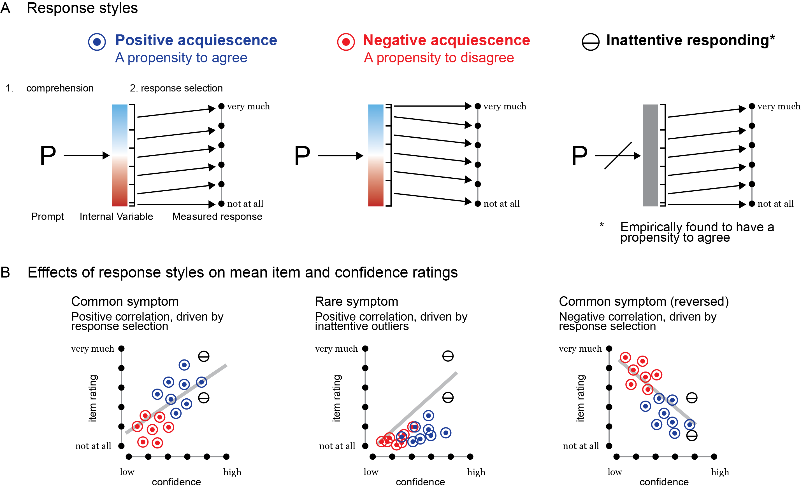
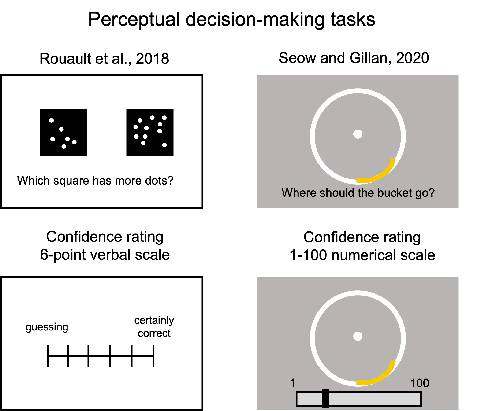
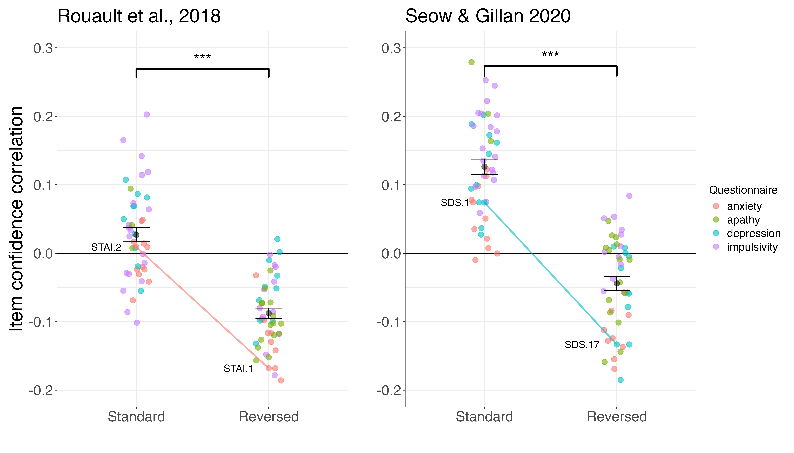
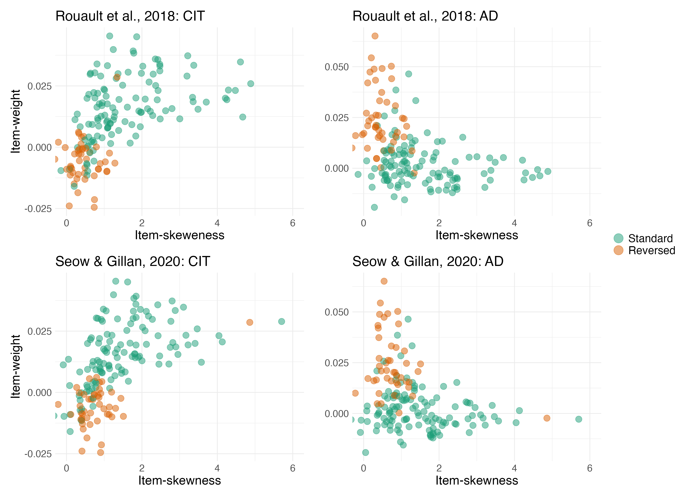
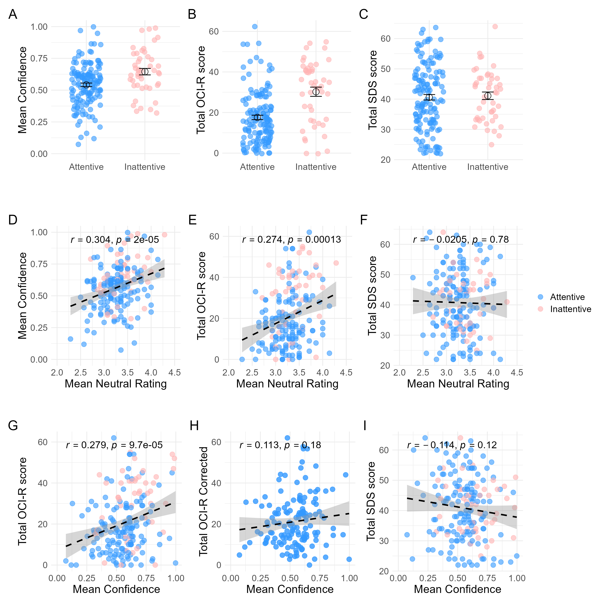

```{r setup, include = FALSE, warning=FALSE}

library('groundhog')
groundhog.library(c(
  "tidyverse",
  "papaja", 
  "moments", #compute skewness
  "lme4", #GLM 
  "ggpubr", #adding coefficients to figures 
  "effectsize", #compute effect sizes
  "patchwork", #combining plots together
  "cowplot", #combining plots together 
  "psych", # For factor analysis
  "polycor" # For heterogeneous correlation matrix (needed for FA)
), 
  "2024-04-23", ignore.deps = c('knitr', 'xfun'), 
force.install=TRUE)

r_refs("r-references.bib")
```

```{r analysis-preferences}
# Seed for random number generation
set.seed(42)
knitr::opts_chunk$set(cache.extra = knitr::rand_seed)

```

# Introduction

The last decade in computational psychiatry can be broadly characterized by two prominent trends: the transition to transdiagnostic phenotyping and the proliferation of large online samples [@gillan2017; @boldt; @fox2024; @gillan2016; @huys2016; @rouault2018; @seow2021; @seow2020; @wise2023; @wise2020]. These trends are linked: transdiagnostic phenotyping strives to define and classify impaired mechanisms across disorders, replacing the traditional focus on disorders as unified, though highly heterogeneous, entities [@insel2010]. In practice, this is often done by having participants complete a large pool of self-report inventories and then using factor analysis to identify a low-dimensional manifold structure in the space of inventory items. Such analysis requires data from large samples, which is made possible by relying on online experimentation [@gillan2016].

The original and most widely used factor analysis of this type, aiming to find a specific psychiatric dimension associated with deficits in goal-directed control, was published by @gillanDaw2016. In their analysis, three factors emerged from a pool of ten psychiatric questionnaires and were termed Anxious-Depression (AD), Compulsive Behavior and Intrusive Thought (CIT), and Social Withdrawal (SW). These factor labels were derived from the individual items with the highest and most consistent loadings on each factor. In the AD factor, the highest loading items were from questionnaires assessing trait anxiety, apathy and depression; in the CIT factor, from measures of obsessive-compulsive disorder (OCD), eating disorder and alcohol addiction; and in the SW factor, from a social anxiety inventory [@gillanDaw2016].

In a typical transdiagnostic computational study, once these factors are derived, their relationships with various tasks are assessed. Research looking into metacognition in mental health documented reliable associations between transdiagnostic psychiatric dimensions and confidence biases [that is, biases to be over- or under-confident in one's decisions; @hoven2023; @rouault2018; @seow2021; @seow2020; @seow2025; @katyal2025]. A prominent finding in this literature, originally documented in a perceptual discrimination task (deciding which of two briefly presented squares contained more dots), is that higher CIT factor scores were associated with higher decision confidence, and that higher AD factor scores were associated with lower decision confidence [@rouault2018]. This finding has since been replicated in other, independent samples [@benwell2022; @hoven2023; @hoven2023a; @seow2025; @katyal2025] and extended to a variety of cognitive tasks [e.g., predictive inference task, @seow2020; gamified version of the perceptual-decision making task, @fox2024, external reminder-usage task, @boldt].

Confidence abnormalities in psychopathology have attracted much attention as a promising model for interpreting and understanding mental health symptoms, with the transdiagnostic dimensions approach serving as an alternative for the traditional unitary diagnostic framework [for review and discussion see @hoven2019; @seow2021; @wise2023]. Here, we suggest that the well-documented associations between metacognition and transdiagnostic dimensions are driven in large by factors related not to mental health, but to the psychometric properties of self-report questionnaires and to response biases. In particular, we propose that the scores and derived factors that make up the widely used psychiatric dimensions reflect not only the substantive phenomena they are meant to measure (i.e. mental health) but also surface-level individual differences in questionnaire-filling behavior. We submit that the same individual differences manifest also in self-reported confidence ratings, ultimately resulting in incorrect conclusions about the relationship between psychiatric dimensions and confidence.

We consider two properties of questionnaire-filling behaviour that can lead to spurious correlations between psychiatric questionnaire scores and decision confidence: *acquiescence* and *inattentive responding*. Both properties can be described in the context of a process model of self-reports (Fig. \@ref(fig:model)A, leftmost panel). In this model, a questionnaire item (P) induces in a respondent an "internal variable" that corresponds to their level of agreement with the content of the item. This variable is then translated, using a response selection process, to a point on a scale.

Acquiescence is a property of the response selection process, reflecting the tendency of respondents to agree or disagree with self-report items irrespective of its content [@podsakoff2003; Fig. \@ref(fig:model)A, upper panels]. In this paper, we refer to acquiescence as the general tendency to have a rating bias, be it positive or negative. Acquiescence effects have been thoroughly documented, with various methods employed to detect and model them [for review see @mcgrath2010; @weijters2013]. Critically, acquiescence is likely to affect both questionnaire responses and subjective confidence ratings, producing an appearance of a link between decision confidence and symptom severity (Fig \@ref(fig:model)B, left panel).

An inattentive, or careless, responding style is a feature of the first part of the process model, and is broadly defined as responding while paying little attention to the content of questionnaire items, and thereby failing to consistently generate an internal variable [@meade2012]. Inattentive respondents are thought to sample their responses semi-randomly from a nearly uniform distribution [@chandler2020; @zorowitz2023; Fig. \@ref(fig:model)A, rightmost panel]. This uniformity leads to a relative increase in the endorsement of symptoms that have lower prevalence in the general population, effectively making inattentive responders appear highly symptomatic (Figure \@ref(fig:model)B; middle panel). The effect of inattentive responding on correlations with confidence rests on an empirical observation: inattentive responders tend to be overly confident in their responses. In the Results section we provide direct support for this effect, which produces spurious correlations between the endorsement of rare items and decision confidence (Fig. \@ref(fig:model)B, middle panel).

We elaborate on these two independent factors in the Methods section and demonstrate their respective contributions to the reported associations between mental health and metacognition in two large datasets [@rouault2018; @seow2020] in the Results section. Finally, analysis of a new dataset with direct measures of inattentive responding and acquiescence reveals that variability in these surface-level properties of questionnaire-filling behaviour may explain a puzzling finding, obtained only in online studies: over-confidence, rather than the well- documented under-confidence, among participants with compulsive or obsessive-compulsive tendencies.

```{r model, echo=FALSE, fig.cap="A schematic illustration of the effects of acquiescence and inattentive responding on item-confidence correlations. A) We describe the production of a self-report as a two-step process. First, a prompt is read, generating an internal variable that represents a subjective level of agreement. Then, the internal variable is translated to a rating via a response selection process (arrows). We distinguish three prototypical response styles. Positive and negative acquiescence, a feature of the response selection process, correspond respectively to general tendency to agree or disagree with the prompt regardless of item content. Inattentive responding affects both steps of the process: no internal variable is generated, and there is a general tendency to agree. B) The effect of response style on both self-report items and confidence ratings. 'Common symptom' refers to self-report items asking about symptoms with high base-rate prevalence in the population (e.g., \"I get tired for no reason\" SDS, item 10); 'Rare symptom' refers to self-report items asking about symptoms with low base-rate prevalence in the population (e.g., \"I have the impulse to vomit after meals.\" EAT item 26); 'Common (reversed)' refers to symptoms with high base-rate prevalence in the population which are articulated in a reversed tense (e.g., \"I'm mostly happy\" STAI item 10)."}


```

```{r load_data, message=TRUE, warning=FALSE, include=FALSE, paged.print=FALSE}

#load Seow & Gillan, 2020 data including task and questionnaires item 
SeowGillan2020_df <- read.csv('../data/SeowGillanUniteDF.csv')

#load Rouault et al., 2018 data including task and questionnaires item 
Rouault2018_df <- read.csv('../data/Rouault_unite_df.csv')

#load Gillan et al., 2016 Original item weights 
Gillan_2016_item_weights <- read.csv('../data/GillanEtAl2016_itemWeights.csv') %>% 
  rename(item=X, #rename factors 
         AD=X1,
         CIT=X2,
         SW=X3) %>%
  filter(!grepl("^SCZ", item)) #remove SCZ items 

```

```{r define_functions, message=TRUE, warning=FALSE, include=FALSE, paged.print=FALSE}

#$$$$$$$$$$$$$$$$$$$$$$$$$$$$$$$$$$$$$$$$$$$$$$$$$$$$$$$$$$$$$$$$$$$$$$$$$$$$$$$$$$$$$$$$$
# Function to compute skewness and item confidence correlation for each questionnaire item
#$$$$$$$$$$$$$$$$$$$$$$$$$$$$$$$$$$$$$$$$$$$$$$$$$$$$$$$$$$$$$$$$$$$$$$$$$$$$$$$$$$$$$$$$$

compute_skew_cor <- function(q_prefix, data, conf_col) {
  # Define patterns to match both naming conventions
  pattern_dot = paste0("^", q_prefix, "\\.[0-9]+$")
  pattern_nodot = paste0("^", toupper(q_prefix), "[0-9]+$")
  
  # Filter columns for the current questionnaire
  q_columns_dot <- grep(pattern_dot, names(data), value = TRUE)
  q_columns_nodot <- grep(pattern_nodot, names(data), value = TRUE)
  q_columns <- c(q_columns_dot, q_columns_nodot)
  

  # Initialize vectors to store results
  skewness_vals <- numeric(length(q_columns))
  correlation_vals <- numeric(length(q_columns))
  
  # Compute skewness and correlation for each item
  for (i in seq_along(q_columns)) {
    skewness_vals[i] <- moments::skewness(data[[q_columns[i]]], na.rm = TRUE)
    correlation_vals[i] <- cor(data[[q_columns[i]]], data[[conf_col]], use = "complete.obs", method = "pearson")
  }
  
  # Create a data frame of results
  result <- data.frame(
    questionnaire = rep(q_prefix, length(q_columns)),
    item = q_columns,
    skewness = skewness_vals,
    conf_cor = correlation_vals
  )
  
  return(result)
}
#$$$$$$$$$$$$$$$$$$$$$$$$$$$$$$$$$$$$$$$$$$$$$$$$$$$$$$$$$$$$$$$$$$$$$$$$$$$$$$$$$$$$$$$$$
# Function to reverse the scores #########################################################
#$$$$$$$$$$$$$$$$$$$$$$$$$$$$$$$$$$$$$$$$$$$$$$$$$$$$$$$$$$$$$$$$$$$$$$$$$$$$$$$$$$$$$$$$$
reverse_scores <- function(x) {
  min_val <- min(x, na.rm = TRUE)
  max_val <- max(x, na.rm = TRUE)
  return(max_val + min_val - x)
}

#$$$$$$$$$$$$$$$$$$$$$$$$$$$$$$$$$$$$$$$$$$$$$$$$$$$$$$$$$$$$$$$$$$$$$$$$$$$$$$$$$$$$$$$$$
# Normalize scores to a scale ranging from 0 to 1 ########################################
#$$$$$$$$$$$$$$$$$$$$$$$$$$$$$$$$$$$$$$$$$$$$$$$$$$$$$$$$$$$$$$$$$$$$$$$$$$$$$$$$$$$$$$$$$
normalize_scores <- function(x) {
  (x - min(x, na.rm = TRUE)) / (max(x, na.rm = TRUE) - min(x, na.rm = TRUE))
}
#load costume colors for figures 

custom_colors <- c("#1B9E77", "#D95F02")
```

# Results

We start by reporting the reanalysis of two large-scale online metacognition studies, assessing both transdiagnostic dimensions and trial-by-trial confidence ratings. In these studies, participants completed questionnaires for alcohol use (Alcohol Use Disorder Identification Test [AUDIT; Saunders et al., 1993]), apathy (Apathy Evaluation Scale [AES; Marin et al., 1991]), depression (Self-Rating Depression Scale [SDS; Zung, 1965]), eating attitudes (Eating Attitudes Test [EAT-26; Garner et al., 1982]), impulsivity (Barratt Impulsivity Scale [BIS-11; Patton et al., 1995]), obsessive-compulsive tendencies (Obsessive-Compulsive Inventory -- Revised [OCI-R; Foa et al., 2002]), schizotypy (Short scales for measuring schizotypy [Mason et al., 2005]), social anxiety (Liebowitz Social Anxiety Scale [LSAS; Liebowitz, 1987]) and anxiety (State-Trait Anxiety Inventory [STAI; Spielberger, 1970]). The same participants also rated their confidence in perceptual decisions. In Rouault et al. (2018, Exp. 2; Fig. \@ref(fig:tasks) left panel), participants decided which of two briefly presented boxes had more dots in it and rated their subjective confidence on a 6-point scale. In Seow and Gillan (2020; Fig. \@ref(fig:tasks) right panel), participants positioned a bucket to catch a flying particle and rated their subjective confidence on a 100-point scale. For more detail and an explanation of the study selection rationale, see the Methods section.

```{r tasks, echo=FALSE, fig.cap="Illustration of perceptual decision-making tasks re-analyzed in this report. Left: in the dot comparison task used by Rouault et al. (2018), participants decided which of two squares contains more dots and then rated their decision confidence on a 6-point scale. Right:  in the predictive inference task used by Seow and Gillan (2020), participants positioned a bucket (yellow arc on the circle edge) to catch a flying particle and then rated their confidence in that they would catch the particle on a 100-point sliding scale."}


```

```{r, reversed_items, include = FALSE}
#$$$$$$$$$$$$$$$$$$$$$$$$$$$$$$$$$$$$$$$$$$$$$$$$$$$$$$$$$$$$$$$$$$$$$$$$$$$$$$$$$$$$$$$$$
# reversed items and response bias analysis ##############################################
#$$$$$$$$$$$$$$$$$$$$$$$$$$$$$$$$$$$$$$$$$$$$$$$$$$$$$$$$$$$$$$$$$$$$$$$$$$$$$$$$$$$$$$$$$

#create mutual variable names between data sets 
anxiety_items <- paste0("anxiety.", 1:20)
eat_items <- paste0("eat.", 1:26)
alcohol_items <- paste0("alcohol.", 1:10)
zung_items <- paste0("zung.", 1:20)
ocir_items <- paste0("ocir.", 1:18)
leb_items <- paste0("leb.", 1:24)
bis_items <- paste0("bis.", 1:30)
apathy_items <- paste0("apathy.", 1:18)


all_items <- c(anxiety_items, eat_items, alcohol_items, zung_items, ocir_items, leb_items, bis_items, apathy_items)

# Ensure consistent column names for id and mean confidence
names(SeowGillan2020_df)[names(SeowGillan2020_df) == "qnid"] <- "id"
names(Rouault2018_df)[names(Rouault2018_df) == "id"] <- "id"

names(SeowGillan2020_df)[names(SeowGillan2020_df) == "mean_conf"] <- "mean_confidence"
names(Rouault2018_df)[names(Rouault2018_df) == "confMean"] <- "mean_confidence"

# Convert id columns to character type
SeowGillan2020_df$id <- as.character(SeowGillan2020_df$id)
Rouault2018_df$id <- as.character(Rouault2018_df$id)

# Rename columns in SeowGillan2020
names(SeowGillan2020_df)[grep("^STAI", names(SeowGillan2020_df))] <- anxiety_items
names(SeowGillan2020_df)[grep("^EAT", names(SeowGillan2020_df))] <- eat_items
names(SeowGillan2020_df)[grep("^ALCOHOL", names(SeowGillan2020_df))] <- alcohol_items
names(SeowGillan2020_df)[grep("^SDS", names(SeowGillan2020_df))] <- zung_items
names(SeowGillan2020_df)[grep("^OCI", names(SeowGillan2020_df))] <- ocir_items
names(SeowGillan2020_df)[grep("^LSASONE", names(SeowGillan2020_df))] <- leb_items
names(SeowGillan2020_df)[grep("^BIS", names(SeowGillan2020_df))] <- bis_items
names(SeowGillan2020_df)[grep("^AES", names(SeowGillan2020_df))] <- apathy_items

#Rename columns in Gillan weights 
Gillan_2016_item_weights$item <- gsub("^STAI_", "anxiety.", Gillan_2016_item_weights$item)
Gillan_2016_item_weights$item <- gsub("^BIS_", "bis.", Gillan_2016_item_weights$item)
Gillan_2016_item_weights$item <- gsub("^EAT_", "eat.", Gillan_2016_item_weights$item)
Gillan_2016_item_weights$item <- gsub("^OCI_", "ocir.", Gillan_2016_item_weights$item)
Gillan_2016_item_weights$item <- gsub("^AES_", "apathy.", Gillan_2016_item_weights$item)
Gillan_2016_item_weights$item <- gsub("^AUDIT_", "alcohol.", Gillan_2016_item_weights$item)
Gillan_2016_item_weights$item <- gsub("^SDS_", "zung.", Gillan_2016_item_weights$item)
Gillan_2016_item_weights$item <- gsub("^LSAS_", "leb.", Gillan_2016_item_weights$item)


# Define reversed items
reversed_items <- c(
  "bis.1", "bis.7", "bis.8", "bis.9", "bis.10", "bis.12", "bis.13", "bis.15", "bis.20", "bis.29", "bis.30",
  "eat.25",
  "anxiety.1", "anxiety.3", "anxiety.6", "anxiety.7", "anxiety.10", "anxiety.13", "anxiety.14", "anxiety.16", "anxiety.19",
  "zung.2", "zung.5", "zung.6", "zung.11", "zung.12", "zung.14", "zung.16", "zung.17", "zung.18", "zung.20",
  "apathy.1", "apathy.2", "apathy.3", "apathy.4", "apathy.5", "apathy.7", "apathy.8", "apathy.9",
  "apathy.12", "apathy.13","apathy.14", "apathy.15", "apathy.16","apathy.17","apathy.18")

#$$$$$$$$$$$$$$$$$$$$$$$$$$$$$$$$$$$$$$$$$$$$$$$$$$$$$$
# Create a new data frames in native left-to-right space
#$$$$$$$$$$$$$$$$$$$$$$$$$$$$$$$$$$$$$$$$$$$$$$$$$$$$$$
Rouault_native_space <- Rouault2018_df %>%
  select(id, mean_confidence, all_of(all_items))

SeowGillan_native_space <- SeowGillan2020_df %>% 
  select(id, mean_confidence, all_of(all_items))

# Reverse the scores for the reversed items in the new dataframe
Rouault_native_space[reversed_items] <- lapply(Rouault_native_space[reversed_items], reverse_scores)
SeowGillan_native_space[reversed_items] <- lapply(SeowGillan_native_space[reversed_items], reverse_scores)

# Normalize the scores to a scale ranging from 0 to 1
Rouault_native_space[all_items] <- lapply(Rouault_native_space[all_items], normalize_scores)
SeowGillan_native_space[all_items] <- lapply(SeowGillan_native_space[all_items], normalize_scores)

# Compute the mean rating score for each participant excluding eat.25 
Rouault_native_space <- Rouault_native_space %>%
  rowwise() %>%
  mutate(mean_rating_score = mean(c_across(all_of(setdiff(all_items, c("mean_confidence", "eat.25")))), na.rm = TRUE)) %>%
  ungroup()

SeowGillan_native_space <- SeowGillan_native_space %>%
  rowwise() %>%
  mutate(mean_rating_score = mean(c_across(all_of(setdiff(all_items, c("mean_confidence", "eat.25")))), na.rm = TRUE)) %>%
  ungroup()

#%%%%%%%%%%%%%%%%%%%%%%%%%%%%%%%%%%%%%%%
#plot response bias with confidence ####
#%%%%%%%%%%%%%%%%%%%%%%%%%%%%%%%%%%%%%%%
# Define the color palette
colors <- ggpubr::get_palette("Accent", 4)  # Adjust the number of colors as needed

# Calculate mean and median for Rouault 2018 
mean_rating_rouault <- mean(Rouault_native_space$mean_rating_score)
median_rating_rouault <- median(Rouault_native_space$mean_rating_score)
mean_confidence_rouault <- mean(Rouault_native_space$mean_confidence)
median_confidence_rouault <- median(Rouault_native_space$mean_confidence)

# Calculate mean and median for Seow & Gillan 2020 
mean_rating_seowgillan <- mean(SeowGillan_native_space$mean_rating_score)
median_rating_seowgillan <- median(SeowGillan_native_space$mean_rating_score)
mean_confidence_seowgillan <- mean(SeowGillan_native_space$mean_confidence)
median_confidence_seowgillan <- median(SeowGillan_native_space$mean_confidence)

# response bias plot for Rouault et al 2018
Rouault_native_space_fig <- 
  ggplot(Rouault_native_space, aes(x=mean_rating_score, y=mean_confidence)) +
  geom_point(alpha=0.7, size=2.5) +
  geom_smooth(method = "lm", se = TRUE, color = "red", show.legend = FALSE) +
  ggpubr::stat_cor(method = "pearson", color = "black", show.legend = FALSE, 
                   label.y = 1, label.x = 0.2, size = 8, 
                   aes(label = paste0("italic(r) == ", ..r.., "*','~italic(p) == ", ..p..))) +  
  labs(title = "Rouault et al., 2018", y= "Mean confidence rating (1-6 scale)", x= "Mean item rating") +
  theme_minimal() +
  theme(
    plot.title = element_text(size = 24),
    axis.title = element_text(size = 24),
    axis.text = element_text(size = 18),
    axis.title.y.right = element_text(size = 24),  
    axis.text.y.right = element_text(size = 18),   
    axis.title.y = element_blank(), # Remove left y-axis title
    axis.text.y = element_blank()
  ) +
  coord_cartesian(xlim=c(0.18, 0.8), ylim = c(1,6)) +
  scale_y_continuous(sec.axis = dup_axis(name = "Mean confidence rating (1-6 scale)"))

# Response bias plot for Seow & Gillan
SeowGillan_native_space_fig <-
  ggplot(SeowGillan_native_space, aes(x=mean_rating_score, y=mean_confidence)) +
  geom_point(alpha=0.7, size=2.5) +
  geom_smooth(method = "lm", se = TRUE, color = "red", show.legend = FALSE) +
  ggpubr::stat_cor(method = "pearson", color = "black", show.legend = FALSE, 
                   label.y = 1, label.x = 0.2, size = 8,
                   aes(label = paste0("italic(r) == ", ..r.., "*','~italic(p) == ", ..p..))) +  
  labs(title = "Seow & Gillan,  2020", y= "Mean confidence rating (1-100 scale)", x= "Mean item rating") +
  theme_minimal() +
  theme(
    plot.title = element_text(size = 24),
    axis.title = element_text(size = 24),
    axis.text = element_text(size = 18),
    axis.title.y.right = element_text(size = 24),  
    axis.text.y.right = element_text(size = 18),   
    axis.title.y = element_blank(), # Remove left y-axis title
    axis.text.y = element_blank()
  ) +
  coord_cartesian(xlim=c(0.18, 0.8), ylim = c(1,100)) +
  scale_y_continuous(sec.axis = dup_axis(name = "Mean confidence rating (1-100 scale)"))

# Marginal densities for Rouault
xdens_rouault <- cowplot::axis_canvas(Rouault_native_space_fig, axis = "x") +
  geom_density(data = Rouault_native_space, aes(x = mean_rating_score), 
               xlim=c(0.18, 0.8),
               alpha = 0.7, fill = colors[3], color = "black", bw = "nrd0") +
geom_vline(xintercept = mean_rating_rouault, color = "red", linetype = "dashed") +
  geom_vline(xintercept = median_rating_rouault, color = "blue", linetype = "dashed")

ydens_rouault <- cowplot::axis_canvas(Rouault_native_space_fig, axis = "y", coord_flip = TRUE) +
  geom_density(data = Rouault_native_space, aes(x = mean_confidence), 
               alpha = 0.7, fill = colors[2], color = "black", adjust = 1) +
  geom_vline(xintercept = mean_confidence_rouault, color = "red", linetype = "dashed") +
  geom_vline(xintercept = median_confidence_rouault, color = "blue", linetype = "dashed") +
  coord_flip() +
  scale_y_reverse()

p_with_marginal_rouault <- insert_xaxis_grob(Rouault_native_space_fig, xdens_rouault, grid::unit(.2, "null"), position = "top")
p_with_marginal_rouault <- insert_yaxis_grob(p_with_marginal_rouault, ydens_rouault, grid::unit(.2, "null"), position = "left")

# Marginal densities for Seow & Gillan
xdens_seowgillan <- axis_canvas(SeowGillan_native_space_fig, axis = "x") +
  geom_density(data = SeowGillan_native_space, aes(x = mean_rating_score), 
               alpha = 0.7, fill = colors[3], color = "black", adjust = 1) +
  geom_vline(xintercept = mean_rating_seowgillan, color = "red", linetype = "dashed") +
  geom_vline(xintercept = median_rating_seowgillan, color = "blue", linetype = "dashed")

ydens_seowgillan <- axis_canvas(SeowGillan_native_space_fig, axis = "y", coord_flip = TRUE) +
  geom_density(data = SeowGillan_native_space, aes(x = mean_confidence), 
               alpha = 0.7, fill = colors[2], color = "black", adjust = 1) +
  geom_vline(xintercept = mean_confidence_seowgillan, color = "red", linetype = "dashed") +
  geom_vline(xintercept = median_confidence_seowgillan, color = "blue", linetype = "dashed") +
  coord_flip() +
  scale_y_reverse()

p_with_marginal_seowgillan <- insert_xaxis_grob(SeowGillan_native_space_fig, xdens_seowgillan, grid::unit(.2, "null"), position = "top")
p_with_marginal_seowgillan <- insert_yaxis_grob(p_with_marginal_seowgillan, ydens_seowgillan, grid::unit(.2, "null"), position = "left")

# Combine the plots into one figure
mean_rating_figure <-ggdraw(p_with_marginal_rouault) |  ggdraw(p_with_marginal_seowgillan)

# Save the combined figure
# ggsave("../figures/mean_rating.png", mean_rating_figure, width = 16, height = 9)

# correlation coefficients
R2018_rating_bias_cor <-
cor.test(Rouault_native_space$mean_rating_score, Rouault_native_space$mean_confidence, method='pearson')

SG2020_rating_bias_cor <- 
  cor.test(SeowGillan_native_space$mean_rating_score, SeowGillan_native_space$mean_confidence, method='pearson')

# effect sizes: 


# Highest 10 loading items in Gillan et al., 2016 item weights 

  top_15_item_weights_gillan_2016 <- 
  Gillan_2016_item_weights %>% 
  arrange(desc(abs(CIT))) %>% 
  head(15)
  
  # count how many items starts with OCI
  count_oci_in_top_15 <- top_15_item_weights_gillan_2016 %>%
  filter(str_detect(item, "^OCI")) %>%
  nrow()

```

### Analysis 1.1: Testing the effect of acquiescence on confidence rating

Confidence ratings are similar to psychiatric questionnaire items in that they require participants to translate an internal representation to a number, or a point on a scale. As such, they may be subject to similar biases. For example, participants showing positive acquiescence in their rating of psychiatric items (a tendency to produce high ratings) would also tend to show positive acquiescence in their confidence rating (a tendency to report high confidence). This will affect both their apparent mental health profile and, crucially, their mean self-reported confidence level, producing a spurious correlation between the two (Figure \@ref(fig:model)B, leftmost panel). To test whether acquiescence plays a role in the association between confidence and psychiatric dimensions, we calculated for each participant their mean confidence rating over all trials in the perceptual decision-making task, and their mean rating over all self-report items across all psychiatric inventories (with reversed items coded using the original unreversed scale; for more details see Methods). As these studies did not include items with neutral content that could be used to independently assess acquiescence [@weijters2013], we used this mean rating as a proxy for acquiescence.

In Seow and Gillan (2018), there was a positive correlation between mean item rating and mean confidence rating `r apa_print(SG2020_rating_bias_cor)$full_result`; Fig. \@ref(fig:mean-rating), right panel), such that higher mean ratings across items were associated with higher mean confidence ratings. A positive correlation was also found in Rouault et al., 2018 (`r apa_print(R2018_rating_bias_cor)$full_result`). These results can mean at least one of two things: either that psychiatric symptoms, as measured with these questionnaires, are truly associated with higher levels of decision confidence, or that acquiescence in self-report rating scales affects both responses to questionnaire items and confidence ratings, producing a spurious correlation between the two. Our next analysis provides direct support for the second alternative.

```{r mean-rating, echo=FALSE, fig.cap="Correlation between mean item rating and mean confidence rating. Relationship between mean item-rating and mean confidence-rating in Rouault et al., 2018 (left panel) and Seow & Gillan 2020 (right panel). Each point represents a single participant's mean item rating across all inventories and mean confidence rating across all trials. Item-ratings for reversed items were recoded to a left-to-right space (as they were shown to the participant). Item ratings were scaled to a 0-1 range to maintain consistency across inventories with different scales. The red line represents a linear regression fit, and the shaded gray area represents the standard error of the fit. Density plots shown on the y- and x-axis with red dashed lines present the mean and blue dashed lines present the median."}
knitr::include_graphics("../figures/mean_rating_figure.png")
```

```{r item_level_skewness, include=FALSE}
#@@@@@@@@@@@@@@@@@@@@@@@@@@@@@@@@@@@@@@@@@@@@@@@@@@@@@@@@@@@@@@@@@@@@@@
#compute item-level skewness score and correlation with mean confidence
#@@@@@@@@@@@@@@@@@@@@@@@@@@@@@@@@@@@@@@@@@@@@@@@@@@@@@@@@@@@@@@@@@@@@@@

#$$$$$$$$$$$$$$$$$$$$$$$$$$$$$$$$$$$$$$$$$$$$$$$$$$$
#----- predictive inference task Seow & Gillan -------
#$$$$$$$$$$$$$$$$$$$$$$$$$$$$$$$$$$$$$$$$$$$$$$$$$$$

# List of questionnaires
SG2020_questionnaires <- c("anxiety", "eat", "alcohol", "zung", "ocir", "leb", "bis", "apathy")

# Applying the function to each questionnaire and combining results
SG2020_skew_conf_list <- lapply(SG2020_questionnaires, compute_skew_cor, data = SeowGillan2020_df, conf_col='mean_confidence')
SG2020_items_table <- do.call(rbind, SG2020_skew_conf_list) # transform into a df 

# Rename questionnaire values for unified formating between dfs
SG2020_items_table <- SG2020_items_table %>%
  mutate(questionnaire = case_when(
    questionnaire == 'zung' ~ 'depression',
    questionnaire == 'ocir' ~ 'ocd',
    questionnaire == 'leb' ~ 'social_anxiety',
    questionnaire == 'bis' ~ 'impulsivity',
    TRUE ~ questionnaire
  ))

#@@@@@@@@@@@@@@@@@@@@@@@@@@@@@@@@@@@@@@@@@@@@@@@@@@@@@@@@@@@@@@@
#----- perceptual discrimination task Rouault et al 2018 -------
#@@@@@@@@@@@@@@@@@@@@@@@@@@@@@@@@@@@@@@@@@@@@@@@@@@@@@@@@@@@@@@@
# List of questionnaires
R2018_questionnaires <- c("anxiety", "eat", "alcohol", "zung", "ocir", "leb", "bis", "apathy")

# Applying the function to each questionnaire and combining results
R2018_skew_conf_list <- lapply(R2018_questionnaires, compute_skew_cor, data = Rouault2018_df, conf_col='mean_confidence')
R2018_items_table <- do.call(rbind, R2018_skew_conf_list)

# Rename questionnaire values for unified formatting between dfs
R2018_items_table <- R2018_items_table %>%
  mutate(questionnaire = case_when(
    questionnaire == 'zung' ~ 'depression',
    questionnaire == 'ocir' ~ 'ocd',
    questionnaire == 'leb' ~ 'social_anxiety',
    questionnaire == 'bis' ~ 'impulsivity',
    TRUE ~ questionnaire
  ))

#---------- Reversed items coding -------------------

#add reversed coding to both data frames 
R2018_items_table <- R2018_items_table %>%
  mutate(is_reversed = ifelse(item %in% reversed_items, "reversed", "not_reversed"))

SG2020_items_table <- SG2020_items_table %>% 
  mutate(is_reversed = ifelse(item %in% reversed_items, "reversed", "not_reversed"))

# Compute the Z-score for the skewness scores 
# R2018_items_table <- R2018_items_table %>%
#   mutate(Zskew = scale(skewness, center = TRUE, scale = TRUE))
# 
# SG2020_items_table <- SG2020_items_table %>% 
#     mutate(Zskew = scale(skewness, center = TRUE, scale = TRUE))
# 
# # Apply the Fisher z-transformation for the correlation coefficient 
# R2018_items_table <- R2018_items_table %>%
#   mutate(conf_cor_z_transformed = 0.5 * log((1 + conf_cor) / (1 - conf_cor)))
# 
# SG2020_items_table <- SG2020_items_table %>%
#   mutate(conf_cor_z_transformed = 0.5 * log((1 + conf_cor) / (1 - conf_cor)))


#$$$$$$$$$$$$$$$$$$$$$$$$$$$$$$$$$$$$$$$$$$$$$$$$$$$$$$$$$$
# plot reversed items and confidence correlation###########
#$$$$$$$$$$$$$$$$$$$$$$$$$$$$$$$$$$$$$$$$$$$$$$$$$$$$$$$$$$

anxiety_color <- "#f87a71" # 
depression_color <- "#00bec4"

R2018_reversed_fig <- 
  R2018_items_table %>%
  mutate(item = case_when(
    item == "anxiety.2" ~ "STAI.2", #rename to match questionnaire name 
    item == "anxiety.1" ~ "STAI.1",
    TRUE ~ item
  )) %>% 
  filter(questionnaire == 'anxiety' | questionnaire == 'depression' | questionnaire == 'impulsivity' | 
           questionnaire == 'apathy') %>% 
  ggplot(aes(x = is_reversed, y = conf_cor, color = questionnaire)) + 
  geom_text(data = . %>% filter(item == "STAI.2" | item == "STAI.1"), 
            aes(label = item), hjust = 1.5, color = "black", size = 4.5) + 
  geom_abline(intercept=0, slope=0) +
  geom_jitter(width = 0.1, height = 0, size = 3, alpha=0.6) + 
  stat_summary(fun = mean,
               geom = "point",
               position = position_dodge(0.9),
               size = 3, 
               alpha = 0.5,
               color = "black",
               group = 1) +
  stat_summary(fun.data = mean_se,
               geom = "errorbar",
               width = 0.2,
               position = position_dodge(0.9),
               color = "black",
               group = 1) +
  geom_point(data = . %>% filter(item == "STAI.2" | item == "STAI.1"), 
             aes(group = 1), color = anxiety_color, size = 3, alpha=0.6) + # Use anxiety color for points
  geom_line(data = . %>% filter(item == "STAI.2" | item == "STAI.1"), 
            aes(group = 1), color = anxiety_color, size = 1, alpha=0.6) + # Use anxiety color for line
  geom_signif(comparisons = list(c("not_reversed", "reversed")), 
              map_signif_level = TRUE, 
              color = "black", 
              size = 1,
              textsize = 7,
              y_position = 0.25) +
  labs(title = "Rouault et al., 2018", x = "", y = "Item confidence correlation", color = "Questionnaire") +
  scale_x_discrete(labels = c("not_reversed" = "Standard", "reversed" = "Reversed")) +
  coord_cartesian(ylim = c(-0.2, 0.3)) +
  theme_bw() +
  theme(
    plot.title = element_text(size = 24),
    axis.title = element_text(size = 24),
    axis.text = element_text(size = 18),
    legend.text = element_text(size = 20),
    legend.title = element_text(size = 20)
  )

# Create the second plot (Seow & Gillan, 2020)
SG2020_reversed_fig <- 
  SG2020_items_table %>% 
  mutate(item = case_when(
    item == "zung.1" ~ "SDS.1", # Rename to match questionnaire name
    item == "zung.17" ~ "SDS.17",
    TRUE ~ item
  )) %>% 
  filter(questionnaire == 'anxiety' | questionnaire == 'depression' | questionnaire == 'impulsivity' | 
           questionnaire == 'apathy') %>% 
  ggplot(aes(x = is_reversed, y = conf_cor, color = questionnaire)) + 
  geom_text(data = . %>% filter(item == "SDS.17" | item == "SDS.1"), 
            aes(label = item), hjust = 1.5, color = "black", size = 4.5) + 
  geom_abline(intercept=0, slope=0) +
  geom_jitter(width = 0.1, height = 0, size = 3, alpha=0.6) + 
  stat_summary(fun = mean,
               geom = "point",
               position = position_dodge(0.9),
               size = 3, 
               alpha = 0.5,
               color = "black",
               group = 1) +
  stat_summary(fun.data = mean_se,
               geom = "errorbar",
               width = 0.2,
               position = position_dodge(0.9),
               color = "black",
               group = 1) +
  geom_point(data = . %>% filter(item == "SDS.17" | item == "SDS.1"), 
             aes(group = 1), color = depression_color, size = 3, alpha=0.6) + 
  geom_line(data = . %>% filter(item == "SDS.17" | item == "SDS.1"), 
            aes(group = 1), color = depression_color, size = 1, alpha=0.6) + 
  geom_signif(comparisons = list(c("not_reversed", "reversed")), 
              map_signif_level = TRUE, 
              color = "black", 
              size = 1,
              textsize = 7,
              y_position = 0.25) +
  labs(title = "Seow & Gillan 2020", x = "", y = "", color = "Questionnaire") + 
  scale_x_discrete(labels = c("not_reversed" = "Standard", "reversed" = "Reversed")) +
  coord_cartesian(ylim = c(-0.2, 0.3)) +
  theme_bw() +
  theme(
    plot.title = element_text(size = 24),
    axis.title = element_text(size = 24),
    axis.text = element_text(size = 18),
    legend.text = element_text(size = 20),
    legend.title = element_text(size = 20)
  )


reversed_items_fig <- R2018_reversed_fig + SG2020_reversed_fig + 
  plot_layout(guides = 'collect') &
  theme(
    legend.text = element_text(size = 14),
    legend.title = element_text(size = 14)
  )

#ggsave("./figures/figure_3.png", reversed_items_fig, width = 14, height = 8, units = "in", dpi = 600)

# significance testing and effect size 

# Seow & Gillan 2020
reversed_SG2020_t.test<-  
SG2020_items_table %>% 
  filter(questionnaire == 'anxiety' | questionnaire == 'depression' | questionnaire == 'impulsivity' | 
           questionnaire == 'apathy') %>% t.test(conf_cor~is_reversed, data=.) 

reversed_SG2020_d <- cohens_d(
  conf_cor ~ is_reversed,
  data = SG2020_items_table %>% 
    filter(questionnaire == 'anxiety' | questionnaire == 'depression' | 
           questionnaire == 'impulsivity' | questionnaire == 'apathy'))

# Rouault 2018
reversed_R2018_t.test<-  
R2018_items_table %>% 
  filter(questionnaire == 'anxiety' | questionnaire == 'depression' | questionnaire == 'impulsivity' | 
           questionnaire == 'apathy') %>% t.test(conf_cor~is_reversed, data=.) 

reversed_R2018_d <- cohens_d(
  conf_cor ~ is_reversed,
  data = R2018_items_table %>% 
    filter(questionnaire == 'anxiety' | questionnaire == 'depression' | 
           questionnaire == 'impulsivity' | questionnaire == 'apathy')
)

SG_count_reversed_items_table <- 
SG2020_items_table %>% 
  filter(questionnaire == 'anxiety' | questionnaire == 'depression' | questionnaire == 'impulsivity' | 
           questionnaire == 'apathy') %>% 
  group_by(is_reversed) %>% 
  summarise(n=n())

R2018_count_reversed_items_table <- 
R2018_items_table %>% 
  filter(questionnaire == 'anxiety' | questionnaire == 'depression' | questionnaire == 'impulsivity' | 
           questionnaire == 'apathy') %>% 
  group_by(is_reversed) %>% 
  summarise(n=n())


# mixed effects model 
# Rouault 2018 
conf_cor_reversed_R2018_m <- lmerTest::lmer(conf_cor ~ is_reversed + (1 | questionnaire), data = R2018_items_table %>% filter(questionnaire == 'anxiety' | questionnaire == 'depression' | questionnaire == 'impulsivity' | 
           questionnaire == 'apathy'))


#Seow and Gillan 2020 
conf_cor_reversed_SG2020_m <- lmerTest::lmer(conf_cor ~ is_reversed + (1 | questionnaire), data = SG2020_items_table %>% filter(questionnaire == 'anxiety' | questionnaire == 'depression' | questionnaire == 'impulsivity' | 
           questionnaire == 'apathy'))


```

### Analysis 1.2: The effect of acquiescence reflected in reversed coded items

To further assess the magnitude and impact of acquiescence on confidence, we made use of the fact that some questionnaires measuring anxiety [State-Trait Anxiety Inventory, STAI; @spielberger1970], impulsivity [Barratt Impulsivity Scale, BIS-11; @patton1995], depression [Self-Rating Depression Scale, SDS; @zung1965] and apathy [Apathy Evaluation Scale, AES; @marin1991] include reverse-coded items: items that tap into the same cognitive constructs but phrased in opposite ways. For example, items 1 and 2 in the STAI read "I feel pleasant" and "I feel nervous and restless," respectively (possible answers: Almost never, Sometimes, Often, and Almost always). Item 1 is a reversed item. An answer of "Almost always" to this item is coded as 1, and an answer of "Almost never" is coded as 4. The opposite is true for item 2. Crucially, valid responses to these two items should show opposite trends --- low endorsement of pleasantness should be associated with high endorsement of restlessness and vice versa. Conversely, acquiescence is expected to result in an inconsistency between the anxiety scores derived from regular and reversed items, namely high or low endorsement of both pleasantness and restlessness.

Following this rationale, we tested the effect of coding direction (standard or reversed) on the correlation between questionnaire responses and confidence. For each item in the STAI, BIS, SDS and AES, we assessed the correlation between participants' ratings and their mean confidence level in the decision-making task. In this analysis, items were scored based on their semantic meaning, i.e. reversed items are coded using a reversed scale, as explained above. A true association between the measured construct (in the example above, anxiety) and confidence should produce a similar correlation between item and confidence ratings when considering standard and reversed items. In contrast, acquiescence is expected to produce opposite correlations of confidence with standard compared to reverse coded items. This latter pattern is exactly what we found. In the @seow2020 dataset, standard items were on average more positively correlated with mean confidence ratings (mean *r* across the `r print_num(SG_count_reversed_items_table$n[SG_count_reversed_items_table$is_reversed=='not_reversed'])` standard items = `r print_num(reversed_SG2020_t.test$estimate[1])`) than were reversed items (mean *r* across the `r print_num(SG_count_reversed_items_table$n[SG_count_reversed_items_table$is_reversed=='reversed'])` reversed items = `r print_num(reversed_SG2020_t.test$estimate[2])`). A t-test comparing the mean of the Pearson correlation coefficients between the two samples was statistically significant (`r  apa_print(reversed_SG2020_t.test)$full_result`; Figure \@ref(fig:reversed-items), right panel), with a large effect size (Cohen's d = `r round(reversed_SG2020_d$Cohens_d, 2)`, 95% CI [`r round(reversed_SG2020_d$CI_low, 2)`, `r round(reversed_SG2020_d$CI_high, 2)`])). A similar pattern was also observed in the @rouault2018 dataset, where on average, standard items showed a more positive correlation with mean confidence ratings (mean *r* across the `r print_num(R2018_count_reversed_items_table$n[SG_count_reversed_items_table$is_reversed=='not_reversed'])` standard items = `r print_num(reversed_R2018_t.test$estimate[1])`) than reversed items (mean *r* across the `r print_num(R2018_count_reversed_items_table$n[SG_count_reversed_items_table$is_reversed=='reversed'])` reversed items = `r print_num(reversed_R2018_t.test$estimate[2])`, `r apa_print(reversed_R2018_t.test)$full_result` (Figure \@ref(fig:reversed-items), left panel), with a large effect size (Cohen's d = `r round(reversed_R2018_d$Cohens_d, 2)`, 95% CI [`r round(reversed_R2018_d$CI_low, 2)`, `r round(reversed_R2018_d$CI_high, 2)`]). This effect remained significant when accounting for the main (intercept) effect of questionnaire in a mixed-effect model (Seow and Gillan, 2020: `r apa_print(conf_cor_reversed_SG2020_m)$statistic$is_reversedreversed`, Rouault et al, 2018: `r apa_print(conf_cor_reversed_R2018_m)$statistic$is_reversedreversed`; see Appendix).

```{r reversed-items, echo=FALSE, fig.cap="Relationship between reversed-coded items and item confidence correlation. Relationship between item confidence correlation with standard and reversed items. Questionnaires: Anxiety - State-Trait Anxiety Inventory (STAI; Spielberger, 1970). Apathy - Apathy Evaluation Scale (AES; Marin et al., 1991). Depression - Self-Rating Depression Scale (SDS; Zung, 1965). Impulsivity - Barratt Impulsivity Scale (BIS-11; Patton et al., 1995). Reference line at y=0 indicates zero item confidence correlation. STAI.1 (‘I feel pleasant.’) and STAI.2 (‘I feel nervous and restless.’) are items from the STAI inventory. SDS.1 (‘I feel down-hearted and blue.’) and SDS.17 (‘I feel that I am useful and needed.’) are items from the SDS inventory. Upper line and asterisks denote significance (p<0.001) of t-test."}


```

```{r plot section, warning=TRUE, include=FALSE}
#$$$$$$$$$$$$$$$$$$$$$$$$$$$$$$$$$$$$$$$$$$$$$$$$$$$$$$$$$$$$$$$$$$$$$$
################## Skewness-confidence correlation ####################
#$$$$$$$$$$$$$$$$$$$$$$$$$$$$$$$$$$$$$$$$$$$$$$$$$$$$$$$$$$$$$$$$$$$$$$

#compute correlation between confidence correlation and skewness
# Rouault correlation 
Rouault_cor_all_skewness <- cor.test(R2018_items_table$skewness, R2018_items_table$conf_cor, method = 'spearman')

#Seow & Gillan correlation 
SG_cor_result <- cor.test(SG2020_items_table$skewness, SG2020_items_table$conf_cor,  method = 'spearman')

eat.2_conf_cor<- cor.test(Rouault2018_df$eat.2, Rouault2018_df$confMean, method = 'pearson')

# create the r and p value label 
Rouault_skewness_conf_cor_label <- ifelse(
  Rouault_cor_all_skewness$p.value < 0.001,
  paste0("italic(r) == ", signif(Rouault_cor_all_skewness$estimate, 2), "*','~italic(p) < 0.001"),
  paste0("italic(r) == ", signif(Rouault_cor_all_skewness$estimate, 2), "*','~italic(p) == ", signif(Rouault_cor_all_skewness$p.value, 3)))

Rouault2018_skewness_conf <- 
  R2018_items_table %>%
  ggplot(aes(x = skewness, y = conf_cor, label = item, color = is_reversed, shape = questionnaire)) +
  geom_point(alpha = 0.7, size = 2.5, show.legend = FALSE) +
  labs(
    subtitle = "Rouault et al., 2018",
    x = "Skewness",
    y = "Item Confidence Correlation",
    shape = "Questionnaire",
    color = "Reversed"
  ) +
  scale_shape_manual(values = c(0, 1, 15, 10, 2, 16, 11, 3)) + 
  scale_color_manual(values = custom_colors) + 
  theme_minimal() +
  geom_smooth(aes(group = 1), method = "lm", se = TRUE, color = "black", show.legend = FALSE) +
  annotate(
    "text",
    x = 1,  
    y = 0.35, 
    label = Rouault_skewness_conf_cor_label,
    parse = TRUE,
    size = 6
  ) +
  coord_cartesian(xlim = c(0, 6), ylim = c(-0.2, 0.4)) +
  geom_text(
    data = R2018_items_table %>% filter(item == "eat.2"), 
    aes(label = item), vjust = -1, color = "black", size = 4
  ) +
  theme(
    plot.subtitle = element_text(size = 20),
    plot.title = element_text(size = 20),
    axis.title = element_text(size = 18),
    axis.text = element_text(size = 14),
    plot.margin = margin(t = 10, r = 20, b = 10, l = 10)
  )

SG_skewness_conf_cor_label <- ifelse(
  SG_cor_result$p.value < 0.001,
  paste0("italic(r) == ", signif(SG_cor_result$estimate, 2), "*','~italic(p) < 0.001"),
  paste0("italic(r) == ", signif(SG_cor_result$estimate, 2), "*','~italic(p) == ", signif(SG_cor_result$p.value, 3)))

SeowGillan_skewness_conf <- 
  SG2020_items_table %>%
  mutate(item = case_when(
    item == "anxiety.13" ~ "stai.13",
    TRUE ~ item
  )) %>%
  ggplot(aes(x = skewness, y = conf_cor, label = item, color = is_reversed, shape = questionnaire)) +
  geom_point(alpha = 0.7, size = 2.5) +
  labs(
    subtitle = "Seow & Gillan 2020",
    x = "Skewness",
    y = "",
    shape = "Questionnaire"
  ) +  
  scale_shape_manual(values = c(0, 1, 15, 10, 2, 16, 11, 3)) + 
  scale_color_manual(
    values = custom_colors,
    labels = c("Standard", "Reversed")
  ) + 
  theme_minimal() +
  geom_smooth(aes(group = 1), method = "lm", se = TRUE, color = "black", show.legend = FALSE) +
  annotate(
    "text", 
    x = 1,
    y = 0.35, 
    label = SG_skewness_conf_cor_label, 
    parse = TRUE, 
    size = 6
  ) +
  coord_cartesian(xlim = c(0, 6), ylim = c(-0.2, 0.4)) +
  geom_text(
    data = . %>% filter(item == "stai.13"), 
    aes(label = item), vjust = -1, color = "black", size = 4
  ) +
  theme(plot.subtitle = element_text(size = 20),
        plot.title = element_text(size = 20),
        axis.title = element_text(size = 18),
        axis.text = element_text(size = 14),
        plot.margin = margin(t = 10, r = 20, b = 10, l = 10),
        legend.text = element_text(size = 14),
        legend.title = element_text(size = 16)
  ) +
  guides(color = guide_legend(title = NULL))

plot_Rouault_eat_2 <- ggplot(Rouault2018_df, aes(x = factor(eat.2), y = mean_confidence)) +
  geom_jitter(width = 0.1, height = 0.0, alpha = 0.5, shape=15, color="#1B9E77") +
  stat_summary(fun = mean,
                 geom = "point",
                 position = position_dodge(0.9),
                 size = 2,
                 alpha=0.5) +
    stat_summary(fun.data = mean_se,
                 geom = "errorbar",
                 width = 0.4,
                 position = position_dodge(0.9))+
  theme_minimal() +
  scale_x_discrete(labels = c(
    "(0) Never/Rarely\nSometimes", 
    "(1) Often", 
    "(2) Usually", 
    "(3) Always"))+
  theme(plot.title = element_text(size = 16, margin = margin(b = 5)),
        plot.subtitle = element_text(size = 14, margin = margin(b = 10)),
        axis.text.x = element_text(size = 13),
        axis.title.x = element_blank(),
        axis.title.y = element_text(size = 16)) +
  labs(title = "Positive correlation affected by high-rating outliers",
       subtitle = "Eat item 2: 'I avoid eating when I am hungry'",
       y = 'Mean confidence (1-6)')

plot_SG_STAI13 <- 
 ggplot(SeowGillan2020_df, aes(x = factor(anxiety.13), y = mean_confidence)) +
  geom_jitter(width = 0.1, height = 0.0, alpha = 0.5, shape=16, color="#D95F02" ) +
  stat_summary(fun = mean,
               geom = "point",
               position = position_dodge(0.9),
               size = 2,
               alpha=0.5) +
  stat_summary(fun.data = mean_se,
               geom = "errorbar",
               width = 0.4,
               position = position_dodge(0.9))+
  theme_minimal() +
  theme(plot.title = element_text(size = 16, margin = margin(b = 5)),
        plot.subtitle = element_text(size = 14, margin = margin(b = 10)),
        axis.text.x = element_text(size = 13),
        axis.title.x = element_blank(),
        axis.title.y = element_text(size = 16)) +
   scale_x_discrete(labels = c("(1) Almost always", "(2) Often", "(3) Sometimes ", "(4) Almost never"))+
   labs(title = "Negative correlation affected by acquiescence (reversed item)",
        subtitle = "STAI item 13: 'I feel secure'",
        y = 'Mean confidence (1-100)')

bottom_panel <- plot_Rouault_eat_2|plot_SG_STAI13
top_panel <- Rouault2018_skewness_conf|SeowGillan_skewness_conf
combined_skewness_conf_fig <- top_panel/bottom_panel

# ggsave(filename = "./figures/skewness_confidence_relationship.png", combined_skewness_conf_fig, width = 14, height = 10, dpi = 300)

# individual qestionnaires skewness correlation with item confidence correlation 

R2018_ind_quest_skew_conf<- 
  R2018_items_table %>%
  ggplot(aes(x = skewness, y = conf_cor, label = item)) +
  geom_point(alpha = 0.7, size = 2.5, show.legend = FALSE) +
  labs(
    subtitle = "Rouault et al., 2018",
    x = "Skewness",
    y = "Item Confidence Correlation",
    shape = "Questionnaire"
  ) +
  scale_color_manual(values = custom_colors) + 
  theme_minimal() +
  geom_smooth(aes(group = 1), method = "lm", se = TRUE, color = "black", show.legend = FALSE) +
  ggpubr::stat_cor(method = 'pearson')+
  coord_cartesian(xlim = c(0, 6), ylim = c(-0.2, 0.4)) +
  theme(
    plot.subtitle = element_text(size = 20),
    plot.title = element_text(size = 20),
    axis.title = element_text(size = 18),
    axis.text = element_text(size = 14),
    plot.margin = margin(t = 10, r = 20, b = 10, l = 10)
  ) +
    facet_wrap(~questionnaire)
  

SG2020_ind_quest_skew_conf <- 
  SG2020_items_table %>%
    ggplot(aes(x = skewness, y = conf_cor)) +
    geom_point(alpha = 0.7, size = 2.5, show.legend = FALSE) +
    labs(
      subtitle = "Seow & Gillan, 2020",
      x = "Skewness",
      y = "Item Confidence Correlation",
      shape = "Questionnaire"
    ) +
    scale_color_manual(values = custom_colors) + 
    theme_minimal() +
    geom_smooth(aes(group = 1), method = "lm", se = TRUE, color = "black", show.legend = FALSE) +
    ggpubr::stat_cor(method = 'pearson')+
    coord_cartesian(xlim = c(0, 6), ylim = c(-0.2, 0.4)) +
    theme(
      plot.subtitle = element_text(size = 20),
      plot.title = element_text(size = 20),
      axis.title = element_text(size = 18),
      axis.text = element_text(size = 14),
      plot.margin = margin(t = 10, r = 20, b = 10, l = 10)
    ) +
    facet_wrap(~questionnaire)
  
  


```

### Analysis 2: Testing the effect of inattentive responding with item-level skewness

The semi-random responses of inattentive responders make them seem highly symptomatic on items that are rarely endorsed by attentive responders, that is, on items with a right-skewed response distribution. As a result, a participant who endorses a right-skewed item is more likely to be inattentive than a participant who does not [@chandler2020]. For example, consider an item that describes a rare symptom that is experienced by only 10% of the population. If rated on a five-point scale (ranging from 0 ='Almost never' to 4 ='Almost always'), it will receive non-zero ratings from only 10% of attentive participants, but from 80% of inattentive participants who sample their responses uniformly, irrespective of content. Therefore, participants who provide non-zero ratings will be more likely than those who provide zero-ratings to be inattentive responders (see Figure \@ref(fig:model), middle panel).

Given that inattentive participants were previously found to be biased towards using the positive ('agree') half of a survey rating scale [@zorowitz2023], we reasoned that inattentive responders may rate their confidence as higher on average, leading to a spurious positive correlation between the endorsement of rare (right skewed) psychiatric symptoms and decision confidence. Supporting this conjecture, we found a positive correlation between item skewness and ites correlation with confidence in both datasets (Seow & Gillan, 2020: `r apa_print(SG_cor_result)$full_result` , Rouault et al., 2018: `r apa_print(Rouault_cor_all_skewness)$full_result`; figure \@ref(fig:skewness-confidence), top panels), such that as items are more right-skewed---that is, less frequently endorsed---the correlation between item endorsement and mean confidence increases. The positive relationship between skewness and item-confidence correlations was present in most individual questionnaires (5 out of 8) in Rouault et al. (2018) and in all questionnaires in Seow & Gillan (2020), indicating that this association exists independently of specific questionnaire characteristics (see Appendix).

To elucidate the relationship between item skewness and item-confidence correlations, consider item 2 from the Eating Attitudes Test (EAT-2): "I avoid eating when I am hungry;" Fig. \@ref(fig:skewness-confidence), bottom left). Endorsement of this item is significantly correlated with mean confidence (`r apa_print(eat.2_conf_cor)$statistic`), but visual inspection suggests that this correlation is largely driven by a small minority of participants who reported "usually" or "always" and also had a high mean confidence rating. This pattern is more suggestive of a spurious correlation due to inattentive responding---participants reporting high agreement with items without paying attention to their content---than of a substantive psychological relationship between self-starvation and confidence.

```{r skewness-confidence, echo=FALSE, fig.cap="Correlation between item-level skewness and item-confidence correlation. Top panel: each point represents an item from the self-report questionnaires, with the shapes indicating different questionnaires. The x-axis represents the skewness score of each item, which was limited to a range of 0-6 for an easier visualization. The y-axis represents the Pearson correlation coefficient between the item's rating and mean confidence, across individuals. The black line represents a linear regression fit, and the shaded gray area represents the standard error of the fit. Bottom Panel: mean confidence ratings by questionnaire item responses. Left: EAT item 2, 'I avoid eating when I am hungry,' from Rouault et al. (2018), showing a positive correlation affected by high-rating outliers in the 'Usually' and 'Always' response category. Right: STAI item 13, 'I feel secure,' from Seow & Gillan (2020), demonstrating a negative correlation influenced by acquiescence to reversed items. Error bars represent standard errors of the mean. Questionnaires: Alcohol - Alcohol Use Disorder Identification Test (AUDIT; Saunders et al., 1993); Apathy - Apathy Evaluation Scale (AES; Marin et al., 1991); Depression - the Self-Rating Depression Scale (SDS; Zung, 1965); EAT - the Eating Attitudes Test (EAT-26; Garner et al., 1982); Impulsivity - the Barratt Impulsivity Scale (BIS-11; Patton et al., 1995); OCD - the Obsessive-Compulsive Inventory -- Revised (OCI-R; Foa et al., 2002); Anxiety - the State-Trait Anxiety Inventory (STAI; Spielberger, 1970); Social anxiety - Liebowitz Social Anxiety Scale (LSAS; Liebowitz, 1987)."}

knitr::include_graphics("../figures/skewness_confidence_figure.png")
```

```{r item_weights_analysis, include=FALSE}

#@@@@@@@@@@@@@@@@@@@@@@@@@@@@@@@@@@@@@@@@@@@
#add the items weights into the items_table 
#@@@@@@@@@@@@@@@@@@@@@@@@@@@@@@@@@@@@@@@@@@@

R2018_items_table <- R2018_items_table %>% left_join(., Gillan_2016_item_weights, by='item')
SG2020_items_table <- SG2020_items_table %>% left_join(., Gillan_2016_item_weights, by='item')

#%%%%%%%%%%%%%%%%%%%%%%%%%%%%%%%%%%%%%%%%%
# plot weights with confidence correlation
#%%%%%%%%%%%%%%%%%%%%%%%%%%%%%%%%%%%%%%%%%

# Color scale definition with adjusted legend size
scale_color_manual_values <- scale_color_manual(
  values = custom_colors,
  labels = c("Standard", "Reversed"),
  guide = guide_legend(title = NULL, override.aes = list(size = 6))  
)

# Define and adjust all plots
# R2018 plots
R2018_CIT_dimensions_fig <- 
  R2018_items_table %>%
  ggplot(aes(x = skewness, y = CIT, color = is_reversed)) +

  geom_point(alpha = 0.5, size=4) +
  scale_color_manual_values +
  scale_shape_manual(values = c(0, 1, 15, 10, 2, 16, 11, 3)) + 
  theme_minimal() +
  labs(x = 'Item-skeweness', y = 'Item-weight', title = 'Rouault et al., 2018: CIT') +  
  coord_cartesian(xlim=c(0,6))+
theme(
    #legend.position = "none",
    plot.title = element_text(size = 20),
    axis.title = element_text(size = 18),
    axis.text = element_text(size = 14),
    plot.margin = margin(t = 10, r = 20, b = 10, l = 10)
  )

R2018_AD_dimensions_fig <- 
  R2018_items_table %>%
  ggplot(aes(x = skewness, y = AD, color = is_reversed)) +
  geom_point(alpha = 0.5, size=4) +
  scale_color_manual_values +
  theme_minimal() +
  labs(x = 'Item-skewness', title = 'Rouault et al., 2018: AD') +
   coord_cartesian(xlim=c(0,6))+
  theme(legend.position = "none", axis.title.y = element_blank(),
         
    plot.title = element_text(size = 20),
    axis.title = element_text(size = 18),
    axis.text = element_text(size = 14),
    plot.margin = margin(t = 10, r = 20, b = 10, l = 10))

# SG2020 plots
SG_CIT_dimensions_fig <- 
  SG2020_items_table %>%
  ggplot(aes(x = skewness, y = CIT, color = is_reversed)) +
  geom_point(alpha = 0.5, size=4) +
  scale_color_manual_values +
  theme_minimal() +
  coord_cartesian(x=c(0,6))+
  labs(x = 'Item-skewness', y = 'Item-weight', title = 'Seow & Gillan, 2020: CIT') +  
  theme(
    legend.position = "none",
    plot.title = element_text(size = 20),
    axis.title = element_text(size = 18),
    axis.text = element_text(size = 14),
    plot.margin = margin(t = 10, r = 20, b = 10, l = 10)
  )


SG_AD_dimensions_fig <- 
  SG2020_items_table %>%
  ggplot(aes(x = skewness, y = AD, color = is_reversed)) +
  geom_point(alpha = 0.5, size=4) +
  scale_color_manual_values +
  theme_minimal() +
  labs(x = 'Item-skewness', title = 'Seow & Gillan, 2020: AD') +  
  coord_cartesian(xlim=c(0,6))+
theme(legend.position = "none", axis.title.y = element_blank(),
    plot.title = element_text(size = 20),
    axis.title = element_text(size = 18),
    axis.text = element_text(size = 14),
    plot.margin = margin(t = 10, r = 20, b = 10, l = 10))

# Combine the plots in each row
top_row <- wrap_plots(
  R2018_CIT_dimensions_fig + theme(legend.position = "none"), 
  R2018_AD_dimensions_fig + theme(legend.position = "none"), 
  ncol = 2
) + plot_annotation(
  title = "Rouault et al., 2018",
  theme = theme(plot.title = element_text(size = 19))
)

bottom_row <- wrap_plots(
  SG_CIT_dimensions_fig + theme(legend.position = "none"), 
  SG_AD_dimensions_fig + theme(legend.position = "none"), 
  ncol = 2
) + plot_annotation(
  title = "Seow & Gillan, 2020",
  theme = theme(plot.title = element_text(size = 19))
)


dimensions_combined_plot <- top_row / bottom_row + 
  plot_layout(guides = "collect") & 
  theme(
    legend.position = "right",
    legend.title = element_text(size = 16), 
    legend.text = element_text(size = 16)    
  )

#ggsave(filename = "./figures/figure_5.png", dimensions_combined_plot, width = 14, height = 10, dpi = 300)

#significance testing 
R2018_item_weight_skewness_cor<- 
cor.test(R2018_items_table$skewness, R2018_items_table$CIT, method = 'spearman')

SG2020_item_weight_skewness_cor<- 
cor.test(SG2020_items_table$skewness, SG2020_items_table$CIT, method='spearman')

# count how many reversed items in the AD factor 
R2018_count_AD_reversed <- R2018_items_table %>%
  arrange(desc(AD)) %>%
  slice_head(n = 15) %>% 
  count(is_reversed)

SG2020_count_AD_reversed <- SG2020_items_table %>%
  arrange(desc(AD)) %>%
  slice_head(n = 15) %>% 
  count(is_reversed)

CIT_AD_cor <- cor.test(Gillan_2016_item_weights$AD, Gillan_2016_item_weights$CIT, method = 'pearson')
```

### Analysis 3: Associations between transdiagnostic dimensional weights with skewness and coding direction

As discussed in the introduction, the CIT (compulsive behavior and intrusive thought) dimension has been associated with increased mean confidence, whereas the AD (anxious-depression) dimension has been linked to reduced mean confidence [@hoven2023a; @rouault2018; @seow2020]. An alternative explanation for these associations is that both psychiatric dimensions and reported confidence are subject to similar response biases, simultaneously influencing their observed relationships. To examine this explanation, we tested the contribution of acquiescence and inattentive responding to the transdiagnostic factor structure itself, irrespective of confidence ratings. For this, we obtained the factor weights of individual items as originally computed by @gillanDaw2016 as both studies [@rouault2018; @seow2020] rely on these weights in their analysis, and since these factors were computed based on a large sample (N=1413). In Figure \@ref(fig:skewness-dimensions), we plot these item weights against the item skewness with visual coding for reversed items (color-coded in orange) for the CIT and AD dimensions in both datasets. 

Two prominent trends emerge from these plots. First, in the CIT dimension (Figure \@ref(fig:skewness-dimensions), left column) there is a positive correlation between item weight and its skewness, such that more skewed items contribute more to the CIT factor. This association was large and significant in both datasets: in Rouault et al. (2018) (`r apa_print(R2018_item_weight_skewness_cor)$full_result`), and in Seow and Gillan (2020) (`r apa_print(SG2020_item_weight_skewness_cor)$full_result`). This finding is consistent with the conjecture that the positive correlation between the compulsivity dimension and confidence was driven, at least in part, by high confidence ratings among inattentive responders. As items become more skewed, the proportion of inattentive participants is expected to exceed that of truly attentive symptomatic participants (Figure \@ref(fig:model)B, Rare Symptom; see also Chandler et al., 2020). In the appendix we present the results of a simulation, showing that a positive correlation between item skewness and factor weights is unexpected under reasonable assumptions about the link between skewness and diagnostic content. In addition, the highest-loading items were standard rather than reversed items, further indicating that item weights in the CIT factor are largely driven more by item-specific properties, over and above any psychopathology-related characteristics. Second, in the AD dimension (Figure \@ref(fig:skewness-dimensions), right column), a pattern indicating the contribution of both skewness and reversed items is observed, but in the opposite direction to the case of CIT ---reversed items with low skewness load heavily on the AD factor. This pattern is not surprising, given the high negative correlation between the weights of these two factors across items (`r apa_print(CIT_AD_cor)$full_result`).

```{r skewness-dimensions, echo=FALSE, fig.cap="The effect of reversed items and skewness on the CIT and AD dimensions. Top row: Rouault et al. (2018) dataset; Bottom row: Seow and Gillan (2020) dataset. Columns: CIT - Compulsive behavior and intrusive thought; AD - Anxious-depression. Item weights were taken from Gillan et al. (2016). The higher the item's weight, the larger its contribution to the factor. Each point represents an item from one of the inventories shown in Figure 4. Standard and reversed items are color-coded. The X-axis was set to the range 0-6."}

```

So far, we relied on post hoc measures---item skewness and coding direction (standard vs. reversed)--- to assess the impact of inattentiveness and acquiescence on confidence ratings. In the next section, we measure inattentive responding and acquiescence directly, to detect these biases and empirically test their influence on confidence ratings.

```{r online_experiment, warning=FALSE, include=FALSE}

# Task data
raw_df <- read.csv("../data/raw_df_cleaned.csv", stringsAsFactors = FALSE) %>%
  mutate(subj_id = as.character(subj_id))

# Qualtrics data
qualtrics_df_raw <- read.csv("../data/qualtrics_df_cleaned.csv", stringsAsFactors = FALSE) %>%
  mutate(subj_id = as.character(subj_id))

# Prolific demographic data
demographic_df <- read.csv("../data/demographic_df_cleaned.csv", stringsAsFactors = FALSE) %>%
  mutate(subj_id = as.character(subj_id))


tidy_df <- raw_df %>% filter(trial_type=='countDots') %>% select(subj_id, trial_index, block, RT, correct, confidence, confidence_RT, increment, right_array, left_array, response)

#count trials - sanity check  
#trials_df <-
#tidy_df %>% group_by(block, subj_id) %>% summarise(n=n())

total_n <-tidy_df %>% 
  select(subj_id) %>% 
  distinct() %>% 
  nrow()

# prolific id vector from task data
subj_ids <- tidy_df %>%
  select(subj_id) %>%
  distinct() %>%
  dplyr::pull(subj_id)

# id from prolific data
subj_id_from_prolific <- demographic_df %>%
  select(subj_id) %>%
  distinct() %>%
  dplyr::pull(subj_id)

# mean accuracy and confidence for correct/incorrect responses 

acc_df <- 
  tidy_df %>% 
  filter(block != 'practice_with_feedback' & block != 'practice_without_feedback') %>% 
  group_by(subj_id) %>% 
  mutate(accuracy = ifelse(correct=='true', 1,0)) %>% 
  summarise(mean_acc = mean(as.numeric(accuracy)))

excluded_for_accuracy <- acc_df %>% filter(mean_acc<0.6) %>% dplyr::pull(subj_id)

excluded <- c(excluded_for_accuracy)  

tidy_df <- tidy_df %>% filter(!(subj_id %in% excluded))


# N after exclusion 
total_n_after_exclusion <-tidy_df %>% 
  select(subj_id) %>% 
  distinct() %>% 
  nrow()


# construct mean confidence per participant df 
mean_conf_df <- tidy_df %>% 
  filter(block != 'practice_with_feedback' & block != 'practice_without_feedback') %>% 
  group_by(subj_id) %>% 
  summarise(mean_conf = mean(as.numeric(confidence)))


# qualtrics data  ---------------------------------------------------------

qualtrics_df <- qualtrics_df_raw %>% filter(subj_id != 'test')

# Remove the second row which contain internal qualtrics information 
# raw_prolific_data <- qualtrics_df %>%
#   slice(-2) 
 
# Extract the first row as content descriptions
#content_descriptions <- raw_prolific_data[1, ]

# Extract the first row as content descriptions and clean the content descriptions by removing the instruction part
#cleaned_content_descriptions <- sub(".* - ", "", as.character(raw_prolific_data[1, ]))

# Item names and instructions 
item_instructions <- data.frame(
  item_content = sub(".* - ", "", as.character(qualtrics_df_raw[1, ])), # Extract the first row as content descriptions and clean the content descriptions by removing the instruction part
  item_name = colnames(qualtrics_df_raw)
) %>%
  filter(str_detect(item_name, "OCI.R_") | 
           str_detect(item_name, "DASS_anx_") | 
           str_detect(item_name, "zung_") | 
           str_detect(item_name, "neutral_")) %>%
  filter(!str_detect(item_name, "Click")) %>%
  filter(!str_detect(item_name, "DO")) %>%
  filter(!str_detect(item_name, "Page.Submit"))

self_long <- 
  qualtrics_df %>% 
  select(subj_id, matches("OCI.R_"), matches("DASS_anx_"), matches("zung_"), matches("neutral_")) %>%
  select(-contains("Click")) %>% # Self report columns with randomization and RT for block 
  select(subj_id, all_of(item_instructions$item_name)) %>%
  pivot_longer(cols = -subj_id, names_to = "item_name", values_to = "item_value")%>% 
  left_join(., item_instructions, by='item_name')%>% # add item content 
  filter(!(subj_id %in% excluded))

# Infrequncy df 
inf_df <- self_long %>%
  filter(str_detect(item_name, "inf")) %>% # Add a new column to indicate whether the answer failed the attention check
  mutate(attention_check_failed = case_when(
    item_name == "OCI.R_inf_1" & item_value != "0" ~ TRUE,
    item_name == "OCI.R_inf_2" & item_value != "0" ~ TRUE,
    item_name == "zung_inf_1" & !(item_value %in% c("4", "3")) ~ TRUE,
    item_name == "zung_inf_2" & item_value != "1" ~ TRUE,
    TRUE ~ FALSE
  )) %>%
  mutate(fail_indicator = as.integer(attention_check_failed))

item_failures <- inf_df %>%
  select(subj_id, item_name, fail_indicator) %>%
  pivot_wider(names_from = item_name, values_from = fail_indicator, values_fill = list(fail_indicator = 0)) %>% 
  rowwise() %>%
  mutate(total_fail = sum(c_across(-subj_id)))

failed_attention <- item_failures %>% filter(total_fail>0) %>% dplyr::pull(subj_id)

failed_attention__after_exc_num <- item_failures %>% filter(total_fail>0) %>% dplyr::pull(subj_id) %>% length()
percentage_failed_attention <- failed_attention__after_exc_num/total_n

# gender analysis -------------------------------------------------------------------

failed_attention_gender_df <- data.frame(
  subj_id = as.character(subj_ids), 
  failed_attention = subj_ids %in% failed_attention
) %>%
  filter(!(subj_id %in% excluded_for_accuracy)) %>%
  left_join(
    demographic_df %>% 
      mutate(subj_id = as.character(subj_id)) %>% 
      select(subj_id, Sex), 
    by = 'subj_id'
  ) %>%
  filter(Sex %in% c('Male', 'Female')) %>%
  left_join(
    mean_conf_df %>% 
      mutate(subj_id = as.character(subj_id)) %>% 
      select(subj_id, mean_conf), 
    by = 'subj_id'
  ) %>%
  mutate(failed_attention = ifelse(failed_attention, 'Inattentive', 'Attentive'))


count_gender_in_attention <- failed_attention_gender_df %>% 
  group_by(failed_attention, Sex) %>% 
  summarise(n=n())

gender_inatttent <- 
ggplot(count_gender_in_attention, aes(x = factor(failed_attention), y = n, fill = Sex)) +
  geom_bar(stat = "identity", position = "dodge") +
  labs(x = "", y = "Frequency") +
  scale_x_discrete(labels = c("Attentive", "Inattentive")) +
  theme_minimal()+
  theme(text = element_text(size = 16)) 

#ggsave(filename = './figures/figure_A2.png', gender_inatttent, height = 5, width = 5, dpi = 300) 

attention_gender_table <- xtabs(n ~ failed_attention + Sex, data = count_gender_in_attention)

# chi-squared test
chisq_result <- chisq.test(attention_gender_table)

# sample size for chi-square test 
chi_sqaure__sample_size <- sum(attention_gender_table)

# Use apa_print() with sample size
apa_result_chi_sqaure <- apa_print(chisq_result, n = chi_sqaure__sample_size)
attention_gender_table <- as.data.frame(attention_gender_table)

# attentive vs. inattentive 
inattentive_sex_fig<-
failed_attention_gender_df %>%
  filter(!(subj_id %in% excluded_for_accuracy)) %>% 
  filter(Sex == 'Male' | Sex == 'Female') %>% 
  ggplot(aes(x=as.factor(failed_attention), y=mean_conf, color=failed_attention))+
  scale_color_manual(values = c("#3399ff", "#ffb3b3")) + 
  geom_jitter(width = 0.25, alpha = 0.6, size = 3) +
  stat_summary(fun = mean, geom = "point", shape = 21, size = 4, color = "black") +
  stat_summary(fun.data = mean_se, geom = "errorbar", width = 0.2, color = "black")+
  facet_wrap(~Sex) +
  theme_minimal()+
  labs(color='', x='Attentiveness', y='Mean Confidence')+
  theme(text = element_text(size = 16))

#ggsave("./figures/figure_A3.png", plot = inattentive_sex_fig, width = 8, height = 6, dpi = 300)
  
# t.test and effect size for gender inattentiveness 

# make male the reference group 
failed_attention_gender_df$Sex <- factor(failed_attention_gender_df$Sex, 
                                        levels = c("Male", "Female"))

t_test_gender_confidence <- t.test(mean_conf ~ Sex, data = failed_attention_gender_df)

# Cohen's d for gender differences in confidence
gender_confidence_d <- cohens_d(
  mean_conf ~ Sex,
  data = failed_attention_gender_df
)


#@@@@@@@@@@@@@@@@@@@@@@@@@@@@@@@@@@@@@@@@@@@@@@@@@@@@@@@@

# add failed attention 
mean_conf_df <- mean_conf_df %>%
  mutate(
    subj_id = as.character(subj_id),  # Ensure subj_id is character
    failed_attention = ifelse(subj_id %in% as.character(failed_attention), 'Inattentive', 'Attentive') 
  ) %>%
  left_join(acc_df, by = "subj_id")

inattentive_confidence_fig <- 
  mean_conf_df %>% 
  ggplot(aes(x = failed_attention, y = mean_conf, group = failed_attention, color = failed_attention)) +
  geom_jitter(width = 0.25, alpha = 0.6, size = 3) +
  stat_summary(fun = mean, geom = "point", shape = 21, size = 4, color = "black") +
  stat_summary(fun.data = mean_se, geom = "errorbar", width = 0.2, color = "black") +
  labs(x = "", y = "Mean Confidence", color = "") +
  scale_color_manual(values = c("#3399ff", "#ffb3b3")) + 
  theme_minimal() +
  theme(legend.position = "none")+
  theme(text = element_text(size = 16)) +  
  coord_cartesian(ylim = c(0, 1))
  
#ggsave("./figures/inattentive_fig.png", plot = inattentive_confidence_fig, width = 8, height = 8, dpi = 300)

inattentive_t_test_df <- mean_conf_df %>%
  select(failed_attention, mean_conf) %>%
  mutate(failed_attention = factor(failed_attention), # Convert to factor
         failed_attention = relevel(failed_attention, ref = "Inattentive")) 

inattenetive_descriptive <- inattentive_t_test_df %>%
  group_by(failed_attention) %>%
  summarise(sd_mean_conf = sd(mean_conf, na.rm = TRUE),
            mean_conf = mean(mean_conf, na.rm = TRUE))

inattentive_confidence_t_test <- 
t.test(mean_conf ~ failed_attention, data = inattentive_t_test_df, alternative = 'greater')

#@@@@@@@@@@@@@@@@@@@@@@@@@@@@@@@@@@@@@@@@@@@@@@@@@@@@@@@@@@@@@@@@@@@@@@@@@@@@@@@@@@@@@@@@@@@@@@@
# neutral items analysis------------------------------------------------------------------------ 
#@@@@@@@@@@@@@@@@@@@@@@@@@@@@@@@@@@@@@@@@@@@@@@@@@@@@@@@@@@@@@@@@@@@@@@@@@@@@@@@@@@@@@@@@@@@@@@@

neutral_items <- c('neutral_1', 'neutral_2', 'neutral_3', 'neutral_4', 'neutral_5', 'neutral_6', 'neutral_7', 'neutral_8', 
                   'neutral_9', 'neutral_10', 'neutral_11', 'neutral_12', 'neutral_13', 'neutral_14')

rating_bias_df <- self_long %>% filter(item_name %in% neutral_items) %>% group_by(subj_id) %>% 
  summarise(mean_rating = mean(as.numeric(item_value)))

# add mean rating to mean conf df 
mean_conf_df <- mean_conf_df %>% left_join(., rating_bias_df)

# correlation of mean rating and mean confidence 
mean_conf_df$failed_attention <- factor(mean_conf_df$failed_attention, 
                                        levels = c("Attentive", "Inattentive"))

#ggsave("./figures/neutral_confidence_fig.png", plot = neutral_items_confidence_fig, width = 8, height = 8, dpi = 300)

exp.h2.spearman_test <- mean_conf_df %>%
    with(cor.test(mean_rating, mean_conf, method = "spearman"))

exp.h2.pearson_test <- mean_conf_df %>%
  with(cor.test(mean_rating, mean_conf, method = "pearson"))


#ggsave("./figures/figure_6_top.png", plot = figure_6_top, width = 8, height = 4, dpi = 400) 

# acquiescence in inattentive responding 

inattentive_acquies <- 
  mean_conf_df %>% 
  ggplot(aes(x = failed_attention, y = mean_rating, group = failed_attention, color = failed_attention)) +
  geom_jitter(width = 0.25, alpha = 0.6, size = 3) +
  stat_summary(fun = mean, geom = "point", shape = 21, size = 4, color = "black") +
  stat_summary(fun.data = mean_se, geom = "errorbar", width = 0.2, color = "black") +
  labs(x = "", y = "Mean Rating", color = "") +
  scale_color_manual(values = c("#3399ff", "#ffb3b3")) + 
  theme_minimal() +
  theme(legend.position = "none")+
  theme(text = element_text(size = 16)) 
  #coord_cartesian(ylim = c(0, 1))

# t.test
inattentive_acquies_t_test <- mean_conf_df %>%
  select(failed_attention, mean_rating) %>%
  mutate(failed_attention = factor(failed_attention), # Convert to factor
         failed_attention = relevel(failed_attention, ref = "Inattentive")) %>% 
  t.test(mean_rating ~ failed_attention, data = ., alternative = 'greater')

# OCI ---------------------------------------------------------------------------------------

# add oci total (sum of all OCI items) to mean_conf_df 
mean_conf_df <- mean_conf_df %>%
  left_join(
    self_long %>%
      filter(str_detect(item_name, "^OCI.R_")) %>% #select all OCI items 
      filter(item_name != 'OCI.R_inf_1' & item_name != 'OCI.R_inf_2') %>% #remove OCI inf items 
      group_by(subj_id) %>%
      summarise(total_oci = sum(as.numeric(item_value), na.rm = TRUE)) %>%
      rename(subj_id = subj_id),
    by = "subj_id"
  )

# Correlation between OCI with mean confidence after controlling for acquiescence --------------------------------------------------
oci_items_df <- self_long %>% filter(str_starts(item_name, 'OCI.R')) %>% 
  filter(item_name != 'OCI.R_inf_1' & item_name != 'OCI.R_inf_2') 

#add mean rating 
oci_items_df <- oci_items_df %>%
  left_join(., mean_conf_df %>% select(subj_id, mean_rating), by = c("subj_id" = "subj_id"))

# Convert item_value to numeric
oci_items_df$item_value <- as.numeric(oci_items_df$item_value)

oci_acq_correlation <- cor.test(mean_conf_df$total_oci, mean_conf_df$mean_rating, method = "pearson")

#@@@@@@@@@@@@@@@@@@@@@@@@@@@@@@@@@@@@@@@@@
# Correcting items value residual approach  
# Fit linear models and get residuals

# Initialize a list to store results
results <- list()

# get unique item names
items <- unique(oci_items_df$item_name)

# Loop over each item and fit a linear model
for (item in items) {
  # Subset data for the current item
  item_data <- oci_items_df %>% filter(item_name == item)
  
  # Fit  linear model
  model <- lm(item_value ~ mean_rating, data = item_data)
  
  # Extract residuals
  item_data$item_corrected <- residuals(model)
  
  # Store the modified data
  results[[item]] <- item_data
}

# Combine the results into a single dataframe
oci_items_df_corrected <- bind_rows(results)

# create new total corrected oci df 
oci_df_corrected <- oci_items_df_corrected %>% 
  group_by(subj_id) %>% 
  summarise(total_oci_corrected = sum(item_corrected))

# Scale oci_corrected to range 0-62
min_val <- min(oci_df_corrected$total_oci_corrected)
max_val <- max(oci_df_corrected$total_oci_corrected)

oci_df_corrected <- oci_df_corrected %>%
  mutate(total_oci_corrected_scaled = (total_oci_corrected - min_val) / (max_val - min_val) * 62)

# Join scaled scores to mean_conf_df
mean_conf_df <- mean_conf_df %>%
  left_join(oci_df_corrected %>%
              rename(subj_id = subj_id) %>% 
              select(subj_id, total_oci_corrected_scaled),
            by = 'subj_id')

# Plot OCI and confidence 

# plot oci with confidence with color coding for infrequncy fails 
oci_confidence_no_screening<-
  mean_conf_df %>%
  ggplot(aes(x = total_oci, y = mean_conf, color = failed_attention)) +
  geom_point(size = 3, alpha = 0.8) +
  geom_smooth(method = 'lm', color = "black", linetype = "dashed") +
  ggpubr::stat_cor(method = "pearson", color = "black", show.legend = FALSE, 
                   label.y = 0.9, label.x = 0.2, size = 5, 
                   aes(label = paste0("italic(r) == ", ..r.., "*','~italic(p) == ", ..p..)))+
  theme_minimal() +
  #scale_color_gradient(low = "#3399ff", high = "#ffb3b3") + 
  theme_minimal(base_size = 16)+
  scale_color_manual(values = c("#3399ff", "#ffb3b3")) + 
  labs(x = 'Total OCI-R Score', y = 'Mean Confidence', color='')

#filer out inattentive 
oci_confidence_filter_inattentive <-
  mean_conf_df %>%
  filter(failed_attention =='Attentive') %>% 
  ggplot(aes(x = total_oci, y = mean_conf)) +
  geom_point(size = 3, alpha = 0.8, color='#3399ff') +
  geom_smooth(method = 'lm', color = "black", linetype = "dashed") +
  ggpubr::stat_cor(method = "pearson", color = "black", show.legend = FALSE, 
                   label.y = 0.9, label.x = 0.2, size = 5, 
                   aes(label = paste0("italic(r) == ", ..r.., "*','~italic(p) == ", ..p..)))+
  theme_minimal() +
  theme_minimal(base_size = 16)+
  labs(x = 'Total OCI-R Score', y = '', color='')


# oci-confidence correlation stats 
oci_confidence_cor <-
cor.test(mean_conf_df$total_oci, mean_conf_df$mean_conf, method = 'pearson')

oci_confidence_cor_coef <- oci_confidence_cor$estimate

oci_confidence_filter_inattentive_cor <- mean_conf_df %>%
  filter(failed_attention == 'Attentive') %>%
  with(cor.test(total_oci, mean_conf, method = 'pearson'))

oci_confidence_filter_inattentive_cor_coef <- oci_confidence_filter_inattentive_cor$estimate

oci_confidence_filter_inattentive_acq_cor <- mean_conf_df %>%
  filter(failed_attention == 'Attentive') %>%
  with(cor.test(total_oci_corrected_scaled, mean_conf, method = 'pearson'))

oci_confidence_filter_inattentive_acq_cor_coef<- oci_confidence_filter_inattentive_acq_cor$estimate


#inattentive participants OCI scores 
oci_inattention_t.test <- 
t.test(total_oci ~ failed_attention, data = mean_conf_df, paired = FALSE)

# descriptive stats: oci scores of attentive and inattentive
oci_inattention_descriptive <- 
  mean_conf_df %>% 
  group_by(failed_attention) %>% 
  summarise(mean_oci = mean(total_oci), sd_oci = sd(total_oci), n = n())

inattentive_oci_fig <- 
  mean_conf_df %>% 
  ggplot(aes(x = failed_attention, y = total_oci, group = failed_attention, color = failed_attention)) +
  geom_jitter(width = 0.25, alpha = 0.6, size = 3) +
  stat_summary(fun = mean, geom = "point", shape = 21, size = 4, color = "black") +
  stat_summary(fun.data = mean_se, geom = "errorbar", width = 0.2, color = "black") +
  labs(x = "", y = "Total OCI-R score", color = "") +
  scale_color_manual(values = c("#3399ff", "#ffb3b3")) + 
  theme_minimal() +
  theme(legend.position = "none")+
  theme(text = element_text(size = 16))  
  #coord_cartesian(ylim = c(0, 1))

# oci scores correlations with acquiescence across participants 
cor.test(mean_conf_df$total_oci, mean_conf_df$mean_rating, method = 'pearson')

#$$$$$$$$$$$$$$$$$$$$$$$$$$$$$$$$$$$$$$$$$$$$
# compute ocir skewness for each item 
#$$$$$$$$$$$$$$$$$$$$$$$$$$$$$$$$$$$$$$$$$$$$

# Create empty list to store results
oci_skewness_results_list <- list()

# Loop through each OCI item
for(item in ocir_items) {
 skew_value <- moments::skewness(
   oci_items_df %>% 
   filter(item_name == paste0("OCI.R_", substr(item, 6, 7))) %>% 
   select(item_value)
 )[[1]]  
 
 # Store results in list
 oci_skewness_results_list[[item]] <- data.frame(
   item_name = item,
   skewness = skew_value
 )
}

# Combine all results into a single dataframe
oci_skewness_results_df <- do.call(rbind, oci_skewness_results_list)

# Sort by skewness value
oci_skewness_results_df <- oci_skewness_results_df %>% 
 arrange(desc(skewness))

# Calculate mean skewness across all items
ocir_mean_skew <- mean(oci_skewness_results_df$skewness)

#$$$$$$$$$$$$$$$$$$$$$$$$$$$$$$$$$$$$$$$$$$$$$$$$$$$$$$$$$$$$$$$$$$$$$$$$
# Correlation between SDS with mean confidence after controlling for acquiescence------------
#@@@@@@@@@@@@@@@@@@@@@@@@@@@@@@@@@@@@@@@@@@@@@@@@@@@@@@@@@@@@@@@@@@@@@@@@@@@@@@@
sds_items_df <- self_long %>% filter(str_starts(item_name, 'zung_')) %>% 
  filter(item_name != 'zung_inf_1' & item_name != 'zung_inf_2') 

# reverse coding items 

sds_reversed_items <- c("zung_2", "zung_5", "zung_6", "zung_11", "zung_12", "zung_14", "zung_16", "zung_17", "zung_18", "zung_20")

# Convert item_value to numeric
sds_items_df$item_value <- as.numeric(sds_items_df$item_value)

# Apply reverse scoring
sds_items_df <- sds_items_df %>%
  mutate(item_original_value = item_value, 
    item_value = ifelse(item_name %in% sds_reversed_items, 
                        reverse_scores(item_value), 
                        item_value))

#add mean rating 
sds_items_df <- sds_items_df %>%
  left_join(., mean_conf_df %>% select(subj_id, mean_rating, mean_conf), by = c("subj_id" = "subj_id")) %>% # add reversed label 
  mutate(reversed = ifelse(item_name %in% sds_reversed_items, "reversed", "standard"))

sds_item_correlations <- sds_items_df %>%
  group_by(item_name, item_content, reversed) %>%
  summarise(
    confidence_correlation = cor(item_value, mean_conf),
    .groups = 'drop'
  )

#@@@@@@@@@@@@@@@@@@@@@@@@@@@@@@@@@@@@@@@@@
# Correcting items value residual approach  
# Fit linear models and get residuals

# Initialize a list to store results
sds_results <- list()

# get unique item names
sds_items <- unique(sds_items_df$item_name)

# Loop over each item and fit a linear model
for (item in sds_items) {
  # Subset data for the current item
  item_data <- sds_items_df %>% filter(item_name == item)
  
  # Fit  linear model
  model <- lm(item_value ~ mean_rating, data = item_data)
  
  # Extract residuals
  item_data$item_corrected <- residuals(model)
  
  # Store the modified data
  sds_results[[item]] <- item_data
}

# add results to df 
sds_items_df$item_corrected <- bind_rows(sds_results)$item_corrected

# total sds score 
sds_df_total <- sds_items_df %>% 
  group_by(subj_id) %>% 
  summarise(
    total_sds_corrected = sum(item_corrected),
    total_sds = sum(item_value),
    total_sds_rating_space = sum(item_original_value),
    total_sds_positive = sum(item_value[reversed == "standard"]),
    total_sds_negative = sum(item_value[reversed == "reversed"]),
    total_sds_positive_corrected = sum(item_corrected[reversed == "standard"]),
    total_sds_negative_corrected = sum(item_corrected[reversed == "reversed"])
  ) %>% 
  left_join(
    mean_conf_df %>% 
      rename(subj_id = subj_id) %>%
      dplyr::select(subj_id, failed_attention, mean_conf, mean_rating),
    by = "subj_id"
  ) %>% # scaling the corrected scale to the same scale as the original sds scale
  mutate(total_sds_corrected_scaled = (total_sds_corrected - min(total_sds_corrected)) / 
         (max(total_sds_corrected) - min(total_sds_corrected)) * 
         (max(total_sds) - min(total_sds)) + min(total_sds))

#$$$$$$$$$$$$$$$$$$$$$$$$$$$$$$$$$$$$$$
# plot sds correlation with confidence 
sds_confidence_no_screening <-
  sds_df_total %>%
  ggplot(aes(x = total_sds, y = mean_conf, color = failed_attention)) +
  geom_point(size = 3, alpha = 0.8) +
  geom_smooth(method = 'lm', color = "black", linetype = "dashed") +
  ggpubr::stat_cor(method = "pearson", color = "black", show.legend = FALSE, 
                   label.y = 0.9, label.x = 20, size = 5, 
                   aes(label = paste0("italic(r) == ", ..r.., "*','~italic(p) == ", ..p..))) +
  theme_minimal(base_size = 16) +
  scale_color_manual(values = c("#3399ff", "#ffb3b3")) + 
  labs(x = 'Total SDS Score', y = 'Mean Confidence', color = '')+
  coord_cartesian(xlim = c(20, 70))

# Second plot - Only attentive participants, using raw scores
sds_confidence_filter_inattentive <-
  sds_df_total %>%
  filter(failed_attention == 'Attentive') %>% 
  ggplot(aes(x = total_sds, y = mean_conf)) +
  geom_point(size = 3, alpha = 0.8, color = '#3399ff') +
  geom_smooth(method = 'lm', color = "black", linetype = "dashed") +
  ggpubr::stat_cor(method = "pearson", color = "black", show.legend = FALSE, 
                   label.y = 0.9, label.x = 20, size = 5, 
                   aes(label = paste0("italic(r) == ", ..r.., "*','~italic(p) == ", ..p..))) +
  theme_minimal(base_size = 16) +
  labs(x = 'Total SDS Score', y = '', color = '')+
  coord_cartesian(xlim = c(20, 70))

# Third plot - Only attentive participants, using corrected scores
sds_confidence_filter_inattentive_and_acq <- 
  sds_df_total %>%
  filter(failed_attention == 'Attentive') %>% 
  ggplot(aes(x = total_sds_corrected_scaled, y = mean_conf)) +
  geom_point(size = 3, alpha = 0.8, color = '#3399ff') +
  geom_smooth(method = 'lm', color = "black", linetype = "dashed") +
  ggpubr::stat_cor(method = "pearson", color = "black", show.legend = FALSE, 
                   label.y = 0.9, label.x = 20, size = 5, 
                   aes(label = paste0("italic(r) == ", ..r.., "*','~italic(p) == ", ..p..))) +
  theme_minimal(base_size = 16) +
  labs(x = 'Total SDS Corrected', y = '', color = '')+
  coord_cartesian(xlim = c(20, 70))

figure_sds_plots <- ggpubr::ggarrange(
  sds_confidence_no_screening + theme(legend.position = "none"),
  sds_confidence_filter_inattentive + theme(legend.position = "none"),
  sds_confidence_filter_inattentive_and_acq + theme(legend.position = "none"),
  ncol = 3,
  nrow = 1
)

# SDS-confidence correlation stats 
sds_confidence_cor <-
  cor.test(sds_df_total$total_sds, sds_df_total$mean_conf, method = 'pearson')

sds_confidence_filter_inattentive_cor <- sds_df_total %>%
  filter(failed_attention == 'Attentive') %>%
  with(cor.test(total_sds, mean_conf, method = 'pearson'))

sds_confidence_filter_inattentive_cor_coef <- sds_confidence_filter_inattentive_cor$estimate

sds_confidence_filter_inattentive_acq_cor <- sds_df_total %>%
  filter(failed_attention == 'Attentive') %>%
  with(cor.test(total_sds_corrected_scaled, mean_conf, method = 'pearson'))

sds_confidence_filter_inattentive_acq_cor_coef <- sds_confidence_filter_inattentive_acq_cor$estimate

# SDS attentive vs. inattentive scores 
sds_attentiveness_t.test <- 
t.test(total_sds ~ failed_attention, data = sds_df_total, paired = FALSE)

#sds inattentive vs. attentive scores 
sds_inattentiveness_desc <- 
  sds_df_total %>%
  group_by(failed_attention) %>%
  summarise(mean_sds = mean(total_sds), sd_sds = sd(total_sds), n = n())

inattentive_sds_fig <- 
  sds_df_total %>% 
  ggplot(aes(x = failed_attention, y = total_sds, group = failed_attention, color = failed_attention)) +
  geom_jitter(width = 0.25, alpha = 0.6, size = 3) +
  stat_summary(fun = mean, geom = "point", shape = 21, size = 4, color = "black") +
  stat_summary(fun.data = mean_se, geom = "errorbar", width = 0.2, color = "black") +
  labs(x = "", y = "Total SDS score", color = "") +
  scale_color_manual(values = c("#3399ff", "#ffb3b3")) + 
  theme_minimal() +
  theme(legend.position = "none")+
  theme(text = element_text(size = 16))  
  #coord_cartesian(ylim = c(0, 1))

# SDS correlation with acquiescence 
sds_acq_cor <- 
cor.test(sds_df_total$total_sds, sds_df_total$mean_rating, method = 'pearson')

# SDS positive and negative items correlation with acquiescence
#positive items
sds_positive_acq_cor <-
cor.test(sds_df_total$total_sds_positive, sds_df_total$mean_rating, method = 'pearson')
#negative items
sds_negative_acq_cor <-
cor.test(sds_df_total$total_sds_negative, sds_df_total$mean_rating, method = 'pearson')

#$$$$$$$$$$$$$$$$$$$$$$$$$$$$$$$$$$$$$$$$$$$$
sds_confidence_rating_space <- 
sds_df_total %>%
     ggplot(aes(x = total_sds_rating_space, y = mean_conf, color = failed_attention)) +
    geom_point(size = 3, alpha = 0.8) +
    geom_smooth(method = 'lm', color = "black", linetype = "dashed") +
    ggpubr::stat_cor(method = "pearson", color = "black", show.legend = FALSE, 
                     label.y = 0.9, label.x = 20, size = 5, 
                     aes(label = paste0("italic(r) == ", ..r.., "*','~italic(p) == ", ..p..))) +
    theme_minimal(base_size = 16) +
    scale_color_manual(values = c("#3399ff", "#ffb3b3")) + 
     labs(x = 'Total SDS Score', y = 'Mean Confidence', color = '')+
     coord_cartesian(xlim = c(20, 70))

sds_confidence_positive <- 
  sds_df_total %>%
  ggplot(aes(x = total_sds_positive, y = mean_conf, color = failed_attention)) +
  geom_point(size = 3, alpha = 0.8) +
  geom_smooth(method = 'lm', color = "black", linetype = "dashed") +
  ggpubr::stat_cor(method = "pearson", color = "black", show.legend = FALSE, 
                   label.y = 0.9, label.x = 20, size = 5, 
                   aes(label = paste0("italic(r) == ", ..r.., "*','~italic(p) == ", ..p..))) +
  theme_minimal(base_size = 16) +
  scale_color_manual(values = c("#3399ff", "#ffb3b3")) + 
  labs(x = 'Total SDS Score', y = 'Mean Confidence', color = '')


sds_confidence_negative <- 
  sds_df_total %>%
  ggplot(aes(x = total_sds_negative, y = mean_conf, color = failed_attention)) +
  geom_point(size = 3, alpha = 0.8) +
  geom_smooth(method = 'lm', color = "black", linetype = "dashed") +
  ggpubr::stat_cor(method = "pearson", color = "black", show.legend = FALSE, 
                   label.y = 0.9, label.x = 20, size = 5, 
                   aes(label = paste0("italic(r) == ", ..r.., "*','~italic(p) == ", ..p..))) +
  theme_minimal(base_size = 16) +
  scale_color_manual(values = c("#3399ff", "#ffb3b3")) + 
  labs(x = 'Total SDS Score', y = 'Mean Confidence', color = '')

sds_pos_neg <- sds_confidence_positive | sds_confidence_negative

sds_confidence_positive_control_acq <- 
  sds_df_total %>%
  ggplot(aes(x = total_sds_positive_corrected, y = mean_conf, color = failed_attention)) +
  geom_point(size = 3, alpha = 0.8) +
  geom_smooth(method = 'lm', color = "black", linetype = "dashed") +
  ggpubr::stat_cor(method = "pearson", color = "black", show.legend = FALSE, 
                  size = 5, 
                   aes(label = paste0("italic(r) == ", ..r.., "*','~italic(p) == ", ..p..))) +
  theme_minimal(base_size = 16) +
  scale_color_manual(values = c("#3399ff", "#ffb3b3")) + 
  labs(title = 'Total SDS positive corrected for ACQ', x = 'Total SDS Score control for ACQ', y = 'Mean Confidence', color = '')

sds_confidence_negative_control_acq <- 
  sds_df_total %>%
  ggplot(aes(x = total_sds_negative_corrected, y = mean_conf, color = failed_attention)) +
  geom_point(size = 3, alpha = 0.8) +
  geom_smooth(method = 'lm', color = "black", linetype = "dashed") +
  ggpubr::stat_cor(method = "pearson", color = "black", show.legend = FALSE, 
                  size = 5, 
                   aes(label = paste0("italic(r) == ", ..r.., "*','~italic(p) == ", ..p..))) +
  theme_minimal(base_size = 16) +
  scale_color_manual(values = c("#3399ff", "#ffb3b3")) + 
  labs(title = 'Total SDS negative corrected for ACQ', x = 'Total SDS Score control for ACQ', y = 'Mean Confidence', color = '')

SDS_pos_neg_contorl_ACQ <- sds_confidence_positive_control_acq | sds_confidence_negative_control_acq

#ggplot(data=sds_df_total, aes(x=total_sds_positive, y=total_sds_positive_corrected))+
  #geom_point()+geom_smooth(method = 'lm') +ggpubr::stat_cor(method = 'pearson')


sds_reversed_fig <- sds_item_correlations %>%
  mutate(reversed = factor(reversed, levels = c("standard", "reversed"))) %>%
  ggplot(aes(x = reversed, y = confidence_correlation)) + 
  geom_abline(intercept = 0, slope = 0) +
  geom_jitter(width = 0.1, height = 0, size = 3, alpha = 0.6, color = "#3399ff") + 
  stat_summary(fun = mean,
              geom = "point",
              size = 3, 
              alpha = 0.5,
              color = "black") +
  stat_summary(fun.data = mean_se,
              geom = "errorbar",
              width = 0.2,
              color = "black") +
  labs(x = "", y = "Item confidence correlation") +
  scale_x_discrete(labels = c("standard" = "Standard", "reversed" = "Reversed")) +
  coord_cartesian(ylim = c(-0.3, 0.3)) +
  theme_bw() +
  theme(
    plot.title = element_text(size = 24),
    axis.title = element_text(size = 24),
    axis.text = element_text(size = 18)
  )

reversed_sds_ttest <- sds_item_correlations %>%
  t.test(confidence_correlation ~ reversed, data = .)

#correlation between positive/negative SDS and mean rating 

sds_df_total %>% ggplot(aes(x=total_sds_positive, y= mean_rating))+
                          geom_point()+geom_smooth(method = 'lm')+
                          ggpubr::stat_cor(method = 'pearson')

sds_df_total %>% ggplot(aes(x=total_sds_negative, y= mean_rating))+
                          geom_point()+geom_smooth(method = 'lm')+
                          ggpubr::stat_cor(method = 'pearson')

# compute skewness for all SDS items 

# Create empty list to store results
sds_skewness_results_list <- list()

# Loop through each SDS item
for(item in sds_items) {
 skew_value <- moments::skewness(
   sds_items_df %>% 
   filter(item_name == item) %>% 
   select(item_value)
 )[[1]]  # Extract the numeric value from the named vector
 
 # Store results in list
 sds_skewness_results_list[[item]] <- data.frame(
   item_name = item,
   skewness = skew_value
 )
}

# Combine all results into a single dataframe
sds_skewness_results_df <- do.call(rbind, sds_skewness_results_list)

# Calculate mean skewness across all items
sds_mean_skew <- mean(sds_skewness_results_df$skewness)

# compare oci to sds mean skewness score 

#  combined dataframe with a questionnaire identifier
combined_skewness_df <- bind_rows(
  oci_skewness_results_df %>% mutate(questionnaire = "OCI"),
  sds_skewness_results_df %>% mutate(questionnaire = "SDS")
)

# t-test comparing skewness between questionnaires
skewness_ttest_oci_sds <- t.test(
  skewness ~ questionnaire, 
  data = combined_skewness_df
)
#$$$$$$$$$$$$$$$$$$$$$$$$$$$$$$$$$$$$$$$$$$$$$$$$$$$
# Creating online experiment plot ------------------
#$$$$$$$$$$$$$$$$$$$$$$$$$$$$$$$$$$$$$$$$$$$$$$$$$$$

# first row: mean confidence, total OCI-R, total SDS among attentive/inattetive
inattentive_acq_fig_first_row <- 
inattentive_confidence_fig | inattentive_oci_fig | inattentive_sds_fig 

# Second row: acquiescence with: confidence, oci, sds 
neutral_items_confidence_fig <- 
  mean_conf_df %>%
  ggplot(aes(x = mean_rating, y = mean_conf, color = failed_attention)) +
  geom_point(size = 3, alpha = 0.6) +
  geom_smooth(aes(x = mean_rating, y = mean_conf), method = 'lm', color = "black", linetype = "dashed") +
ggpubr::stat_cor(aes(x = mean_rating, y = mean_conf, 
                     label = paste0("italic(r) == ", ..r.., "*','~italic(p) == ", ..p..)), 
                 method = "pearson", color = "black", show.legend = FALSE, size = 5,
                 r.digits = 3)+
  theme_minimal() +
  theme(text = element_text(size = 16),
        legend.position = "none") + 
  coord_cartesian(xlim = c(2, 4.5), ylim = c(0,1)) +
  scale_color_manual(values = c("#3399ff", "#ffb3b3")) + 
  labs(x = 'Mean Neutral Rating', y = 'Mean Confidence', color='')

neutral_items_oci_fig <- 
  mean_conf_df %>%
  ggplot(aes(x = mean_rating, y = total_oci, color = failed_attention)) +
  geom_point(size = 3, alpha = 0.6) +
  geom_smooth(method = 'lm', color = "black", linetype = "dashed") +
  ggpubr::stat_cor(aes(x = mean_rating, y = total_oci, 
                     label = paste0("italic(r) == ", ..r.., "*','~italic(p) == ", ..p..)), 
                 method = "pearson", color = "black", show.legend = FALSE, size = 5,
                 r.digits = 3)+  theme_minimal() +
  theme(text = element_text(size = 16),
        legend.position = "none") +  
  coord_cartesian(xlim = c(2, 4.5)) +
  scale_color_manual(values = c("#3399ff", "#ffb3b3")) + 
  labs(x = 'Mean Neutral Rating', y = 'Total OCI-R score', color='')

neutral_items_sds_fig <- 
  sds_df_total %>%
  ggplot(aes(x = mean_rating, y = total_sds, color = failed_attention)) +
  geom_point(size = 3, alpha = 0.6) +
  geom_smooth(method = 'lm', color = "black", linetype = "dashed") +
  ggpubr::stat_cor(aes(x = mean_rating, y = total_sds, 
                     label = paste0("italic(r) == ", ..r.., "*','~italic(p) == ", ..p..)), 
                 method = "pearson", color = "black", show.legend = FALSE, size = 5,
                 r.digits = 3)+  
  theme_minimal() +
  theme(text = element_text(size = 16)) +  
  coord_cartesian(xlim = c(2, 4.5)) +
  scale_color_manual(values = c("#3399ff", "#ffb3b3")) + 
  labs(x = 'Mean Neutral Rating', y = 'Total SDS score', color='')

inattentive_acq_fig_second_row <- 
  neutral_items_confidence_fig | neutral_items_oci_fig | neutral_items_sds_fig 

# Third row: confidence with oci and sds
confidence_oci_fig <- 
  mean_conf_df %>%
  ggplot(aes(x = mean_conf, y = total_oci, color = failed_attention)) +
  geom_point(size = 3, alpha = 0.6) +
  geom_smooth(method = 'lm', color = "black", linetype = "dashed") +
  ggpubr::stat_cor(aes(x = mean_conf, y = total_oci, 
                     label = paste0("italic(r) == ", ..r.., "*','~italic(p) == ", ..p..)), 
                 method = "pearson", color = "black", show.legend = FALSE, size = 5,
                 r.digits = 3)+  theme_minimal() +
  theme(text = element_text(size = 16),
        legend.position = "none") +  
  coord_cartesian(xlim = c(0, 1)) +
  scale_color_manual(values = c("#3399ff", "#ffb3b3")) + 
  labs(x = 'Mean Confidence', y = 'Total OCI-R score', color='')

confidence_sds_fig <- 
  sds_df_total %>%
  ggplot(aes(x = mean_conf, y = total_sds, color = failed_attention)) +
  geom_point(size = 3, alpha = 0.6) +
  geom_smooth(method = 'lm', color = "black", linetype = "dashed") +
  ggpubr::stat_cor(aes(x = mean_conf, y = total_sds, 
                     label = paste0("italic(r) == ", ..r.., "*','~italic(p) == ", ..p..)), 
                 method = "pearson", color = "black", show.legend = FALSE, size = 5,
                 r.digits = 3)+  
  theme_minimal() +
  theme(text = element_text(size = 16),
        legend.position = 'none') +  
  coord_cartesian(xlim = c(0, 1)) +
  scale_color_manual(values = c("#3399ff", "#ffb3b3")) + 
  labs(x = 'Mean Confidence', y = 'Total SDS score', color='')

# Plotting the scaled OCI with mean confidence
oci_confidence_filter_inattentive_and_acq <- 
mean_conf_df %>%
  filter(failed_attention =='Attentive') %>% 
  ggplot(aes(x = mean_conf, y = total_oci_corrected_scaled)) +
  geom_point(size = 3, alpha = 0.8, color='#3399ff') +
  geom_smooth(method = 'lm', color = "black", linetype = "dashed") +
  ggpubr::stat_cor(aes(x = mean_conf, y = total_oci_corrected_scaled, 
                     label = paste0("italic(r) == ", ..r.., "*','~italic(p) == ", ..p..)), 
                 method = "pearson", color = "black", show.legend = FALSE, size = 5,
                 r.digits = 3)+  
  theme_minimal() +
  theme(text = element_text(size = 16),
        legend.position = 'none') + 
  coord_cartesian(xlim = c(0, 1)) +
  labs(x = 'Mean Confidence', y = 'Total OCI-R Corrected', color='')


inattentive_acq_fig_third_row <- confidence_oci_fig | oci_confidence_filter_inattentive_and_acq| confidence_sds_fig

inattentive_acq_fig <- (inattentive_acq_fig_first_row / 
                        plot_spacer() / 
                        inattentive_acq_fig_second_row / 
                        plot_spacer() / 
                        inattentive_acq_fig_third_row) +
  plot_layout(heights = c(1, 0.1, 1, 0.1, 1)) + 
  plot_annotation(tag_levels = 'A')

# ggsave("./figures/inattentive_acq_fig.png", 
#        inattentive_acq_fig,
#        width = 12,      
#        height = 12,     
#        dpi = 300)       


#$$$$$$$$$$$$$$$$$$$$$$$$$$$$$$$$$$$$$$$$$$$$$$$$$$$$$$$$$$$$$$$$$$$$$$$$
#$$$$$$$$$$$$$$$$$$$$$$$$$$$$$$$$$$$$$$$$$$$$$$$$$$$$$$$$$$$$$$$$$$$$$$$$
# mean increment and confidence  ----------------------------------------
#%%%%%%%%%%%%%%%%%%%%%%%%%%%%%%%%%%%%%%%%%%%%%%%%%%%%%%%%%%%%%%%%%%%%%%%%
#%%%%%%%%%%%%%%%%%%%%%%%%%%%%%%%%%%%%%%%%%%%%%%%%%%%%%%%%%%%%%%%%%%%%%%%%

mean_difficulty_df <- 
  tidy_df %>%  
  group_by(subj_id) %>% 
  summarise(
    mean_increment = mean(as.numeric(increment)),
    mean_difficulty =  - mean_increment
  ) %>%
  left_join(., mean_conf_df %>% # add failed attention
        select(subj_id, failed_attention, mean_conf))

# check if inattentive had easier task. 

difficulty_t_test <- t.test(mean_difficulty ~ failed_attention, data = mean_difficulty_df, var.equal = TRUE)

difficulty_attention_plot <- 
  mean_difficulty_df %>% 
  ggplot(aes(x=failed_attention, y=mean_difficulty, color=failed_attention)) +
  geom_jitter(size=2.5, alpha=0.8, width = 0.2) +
  stat_summary(fun = mean, geom = 'point', color='black') +
  stat_summary(fun.data = mean_se, geom = 'errorbar', color='black', width=0.2) +
  scale_color_manual(values = c("Attentive" = "#3399ff", "Inattentive" = "#ffb3b3")) +
  labs(color = NULL, x='Attentiveness', y='Mean Difficulty') +
  coord_cartesian(ylim = c(-70,-10)) +
  theme_minimal()+
  theme(text = element_text(size = 20))


# correlation between task difficulty and mean confidence 
difficulty_confidence_plot <- 
  mean_difficulty_df %>% 
  ggplot(aes(x = mean_conf, y = mean_difficulty)) +
  geom_point(aes(color = failed_attention), size = 2.5, alpha = 0.8) +
  geom_smooth(method = 'lm', color = "black") +
  ggpubr::stat_cor(method = "spearman", size=5, color = "black", show.legend = FALSE, 
                   aes(label = paste0("italic(r) == ", ..r.., "*','~italic(p) == ", ..p..))) +
  scale_color_manual(values = c("Attentive" = "#3399ff", "Inattentive" = "#ffb3b3")) +
  labs(color = NULL, x='Mean Confidence', y='') +
  coord_cartesian(ylim = c(-70,-10)) +
  theme_minimal()+
  theme(text = element_text(size = 20))


difficulty_attention_combined_plot <- ggarrange(difficulty_attention_plot, difficulty_confidence_plot, nrow = 1, common.legend = TRUE, legend = "right")
  
#ggsave(filename = './figures/figure_A4.png',difficulty_attention_combined_plot, width = 10, height = 6, dpi = 300)

difficulty_confidence_cor <- cor.test(mean_difficulty_df$mean_conf, mean_difficulty_df$mean_difficulty, method = 'spearman')

#$$$$$$$$$$$$$$$$$$$$$$$$$$$$$$$$$$$$$$$$$$$$$$$$$$$$$$$$
## Effects of inattentiveness and acquiesence controlling for age and sex ------------------------
#$$$$$$$$$$$$$$$$$$$$$$$$$$$$$$$$$$$$$$$$$$$$$$$$$$$$$$$$
contorl_age_sex_df <- mean_conf_df %>% 
  left_join(., demographic_df %>% 
              select(subj_id, Age, Sex),
             by = "subj_id") %>% 
  filter(!(Age %in% c('CONSENT_REVOKED', 'DATA_EXPIRED')) & 
           !(Sex %in% c('CONSENT_REVOKED', 'DATA_EXPIRED')))

contorl_age_sex_df$Age <- as.numeric(contorl_age_sex_df$Age)

# Models predicting mean confidence from inattentiveness and acquiescence 
conf_inatt_m <- lm(mean_conf ~ failed_attention + Sex + Age, data = contorl_age_sex_df)
summary(conf_inatt_m)


# Models predicting mean confidence from acquiescence
conf_acq_m <- lm(mean_conf ~ mean_rating + Sex + Age, data = contorl_age_sex_df)
summary(conf_acq_m)

#$$$$$$$$$$$$$$$$$$$$$$$$$$$$$$$$$$$$$$$$$$$$$$$$$$$$$$$$
# effect sizes $$$$$$$$$$$$$$$$$$$$$$$$$$$$$$$$$$$$$$$$$$
#$$$$$$$$$$$$$$$$$$$$$$$$$$$$$$$$$$$$$$$$$$$$$$$$$$$$$$$$

# Inattentive vs attentive confidence comparison
inattentive_confidence_d <- cohens_d(
  mean_conf ~ failed_attention,
  data = mean_conf_df
)

# Inattentive vs attentive OCI-R scores
oci_inattention_d <- cohens_d(
  total_oci ~ failed_attention,
  data = mean_conf_df %>% 
    mutate(failed_attention = factor(failed_attention, 
                                    levels = c("Inattentive", "Attentive")))
)

# SDS attentive vs inattentive scores
sds_attentiveness_d <- cohens_d(
  total_sds ~ failed_attention,
  data = sds_df_total %>% 
    mutate(failed_attention = factor(failed_attention, 
                                    levels = c("Inattentive", "Attentive")))
)

```

## Inattentiveness and acquiescence are associated with shifts in confidence ratings

We conducted an online experiment involving a perceptual decision task with self-report measures designed to detect inattentive responding and acquiescence. Our sample comprised 195 participants recruited from Prolific, of whom 50 were classified as inattentive, in line with our preregistered sample size (<https://osf.io/jdquy>). Using the same perceptual decision task as in @rouault2018, participants were asked to decide which of two squares contained more black dots and rate their confidence in this decision. Five participants were excluded for having an average accuracy below 60%. Subsequently, participants completed questionnaires for OCD [OCI-R; @foa2002] and depression [SDS; @zung1965].Inattentive participants were detected using catch 'infrequency items', such as "I often rearrange the furniture in my home to prepare for the arrival of magical beans" (expected answer: 'not at all'), as suggested by Zorowitz and colleagues (2023).

In addition, we included an inventory of 14 "content-neutral" items, that were curated by us to quantify participants' tendency to produce high or low ratings irrespective or content. We used a subset of items from the validated Extreme Response Style inventory (e.g. "I like to visit places that are totally different from my home", @greenleaf1992), and added items of our own (e.g., "I believe there are relatively few different breeds of cats"). Crucially, items were chosen such that psychopathology-relevant content should be balanced out at the inventory level. For example, the novelty-avoiding item "When I go shopping, I find myself spending very little time checking out new products and brands" was mirrored by the novelty-seeking item "I like to visit places that are totally different from my home." As a result, the mean rating to these items should primarily reflect participants tendency to agree with statements regardless of their content, that is, their acquiescence.

The experiment aimed to test two main hypotheses: that inattentive participants provide higher confidence ratings compared to attentive participants, and that acquiescence is positively correlated with confidence ratings. Consistent with our first hypothesis, inattentive participants gave significantly higher confidence ratings (*M* = `r print_num(inattenetive_descriptive$mean_conf[inattenetive_descriptive$failed_attention=='Inattentive'])`, *SD* = `r print_num(inattenetive_descriptive$sd_mean_conf[inattenetive_descriptive$failed_attention=='Inattentive'])`) compared to attentive participants (*M* = `r print_num(inattenetive_descriptive$mean_conf[inattenetive_descriptive$failed_attention=='Attentive'])`, *SD* = `r print_num(inattenetive_descriptive$sd_mean_conf[inattenetive_descriptive$failed_attention=='Attentive'])`;`r apa_print(inattentive_confidence_t_test)$statistic`) Figure \@ref(fig:experiment), panel A), with a medium-to-large effect size (Cohen's d = `r round(inattentive_confidence_d$Cohens_d, 2)`, 95% CI [`r round(inattentive_confidence_d$CI_low, 2)`, `r round(inattentive_confidence_d$CI_high, 2)`]). In addition, and consistent with our second hypothesis, acquiescence was moderatly correlated with mean confidence across the entire sample. As preregistered, a Spearman correlation showed a significant association `r apa_print(exp.h2.spearman_test)$full_result`). To maintain consistency with the other analyses, we also report Pearson's correlation, which yielded a similar effect (`r apa_print(exp.h2.pearson_test)$full_result`;  Figure \@ref(fig:experiment), panel D). The effects of inattentiveness and acquiescence remained significant when controlling for age and sex (see Appendix).

Next, we performed a series of exploratory analyses to measure the contribution of inattentiveness and acquiescence to the correlations between decision confidence and psychiatric questionnaire scores. First, we examined the association between obsessive-compulsive tendencies and mean confidence and found that the two were positively correlated (`r apa_print(oci_confidence_cor)$full_result`; Figure \@ref(fig:experiment), panel E). This finding aligns with previous reports of overconfidence in participants with high OCI-R scores [@hoven2023; @seow2021] and those with high CIT factor scores  [@rouault2018; @hoven2023a]. As noted above, this positive correlation contrasts sharply with the clinical presentation of doubt, indecisiveness and heightened uncertainty among individuals with OCD [@dar2004; @dar2021; @rasmussen1989; @sarig2012] and with experimental findings of under-confidence in OCD from lab-based experiments [@cougle2007; @dar2004; @karadag2005; @marton2019; @mcnally1993; @zitterl2001; for review see @dar2022]. We were therefore especially interested to see how this correlation would relate to the two surface-level properties of questionnaire-filling behaviour, namely acquiescence and inattentive responding.

Two aspects of the OCI-R questionnaire make it particularly vulnerable to inattentive and biased responding. First, several OCI-R items represent rare behaviours and cognitions (e.g., OCI-R item 10: "I feel I have to repeat certain numbers."), with a mean skewness of `r print_num(ocir_mean_skew)` across all items. As a result, inattentive participants, who sample their responses semi-randomly, would appear highly symptomatic on this inventory. And second, the OCI-R contains no reversed items, which opens the door to acquiescence effects. Supporting this conjecture, inattentive participants, identified based on infrequency items, had much higher OCI-R scores (mean OCI-R= `r print_num(oci_inattention_descriptive$mean_oci[oci_inattention_descriptive$failed_attention == "Inattentive"])`) than attentive participants (mean OCI-R= `r print_num(oci_inattention_descriptive$mean_oci[oci_inattention_descriptive$failed_attention == "Attentive"])`, `r apa_print(oci_inattention_t.test)$statistic`), with a large effect size (Cohen's d = `r round(oci_inattention_d$Cohens_d, 2)`, 95% CI [`r round(oci_inattention_d$CI_low, 2)`, `r round(oci_inattention_d$CI_high, 2)`]). Furthermore, OCI-R was significantly correlated with acquiescence, measured as the mean rating over content-neutral items, across participants (`r apa_print(oci_acq_correlation)$full_result`). When we excluded inattentive participants, the correlation between OCI-R and confidence weakened (`r apa_print(oci_confidence_filter_inattentive_cor)$full_result`) and became non-significant when further controlling for acquiescence by regressing out the mean response to content-neutral items (`r apa_print(oci_confidence_filter_inattentive_acq_cor)$full_result` Figure \@ref(fig:experiment), panel H). In the appendix we provide additional analysis to show that this reduction in the correlation coefficient cannot be explained by the reduction in the sample size (excluding inattentive participants) nor by the correction procedure (regressing out the mean response to neutral items). 

Turning to the SDS depression questionnaire, we observed the expected negative correlation between total scores and decision confidence (although this correlation was not statistically significant,`r apa_print(sds_confidence_cor)$full_result`). Low confidence among depressed individuals is in line with the clinical picture of low self-esteem and low self-efficacy that characterize depression [@fu2005; @hancock1996; @richards2011; @szu-tingfu2012]. Responses to SDS items were descriptively less skewed than to OCI-R items (mean skewness across items, with reversed items reversed= `r print_num(mean(sds_skewness_results_df$skewness))`), as most SDS items pertain to thought patterns that are more common in the general population (with the notable exception of two highly skewed items: "I have trouble with constipation," skewness = `r print_num(sds_skewness_results_df$skewness[sds_skewness_results_df$item_name=='zung_8'])`, and "I feel that others would be better off if I were dead," skewness = `r print_num(sds_skewness_results_df$skewness[sds_skewness_results_df$item_name=='zung_19'])`). Presumably for that reason, there was no difference in SDS scores between attentive (mean total SDS = `r print_num(sds_inattentiveness_desc$mean_sds[sds_inattentiveness_desc$failed_attention=='Attentive'])`) and inattentive responders (mean total SDS = `r print_num(sds_inattentiveness_desc$mean_sds[sds_inattentiveness_desc$failed_attention=='Inattentive'])`; `r apa_print(sds_attentiveness_t.test)$statistic`; Cohen's d = `r round(sds_attentiveness_d$Cohens_d, 2)`, 95% CI [`r round(sds_attentiveness_d$CI_low, 2)`, `r round(sds_attentiveness_d$CI_high, 2)`]). Furthermore, with half of the items being reverse-coded, SDS is robust to effects of acquiescence, and indeed, SDS scores were uncorrelated with acquiescence (`r apa_print(sds_acq_cor)$full_result`). This null effect was due to opposing effects of acquiescence on SDS standard items (`r apa_print(sds_positive_acq_cor)$full_result`) and reversed items (`r apa_print(sds_negative_acq_cor)$full_result`), which cancelled each other out. Consequently, unlike the OCI-R, the correlation between SDS and confidence was unaffected by the removal of inattentive responders (`r apa_print(sds_confidence_filter_inattentive_cor)$full_result`) and when controlling for acquiescence (`r apa_print(sds_confidence_filter_inattentive_acq_cor)$full_result`).

```{r experiment, echo=FALSE, fig.cap="Effects of inattentiveness and acquiescence on confidence ratings, OCI-R and SDS scores. Panels A-C show comparisons between attentive and inattentive participants for: (A) mean confidence, (B) total OCI-R scores, and (C) total SDS scores. Each point represents scores for one participant. The hollow black circles represent the group mean and error bars show standard error of the mean (SEM). Inattentive participants are marked in pink. Panels D-F show the Pearson correlation between acquiescence and: (D) mean confidence, (E) total OCI-R scores, and (F) total SDS scores across participants. The dashed line indicates a linear fit, with the shaded area showing the 95% confidence interval. Panels G-I show the Pearson correlations between mean confidence and: (G) total OCI-R scores, (H) total OCI-R corrected for acquiescence and excluding inattentive participants and (I) total SDS scores. "}

```

# Discussion

Decades of psychological research have identified limitations in the use of self-reports as a measure of psychological traits and mental health [@bagozzi1990; @baumgartner2001; @campbell; @chandler2020; @curran2016; @greenleaf1992; @huang2012; @meade2012; @nichols1989; @ophir2020; @podsakoff2003; @spector1987; @weijters2013], devising partial solutions and practical best-practice recommendations [see @huang2015; @weijters2013]. This accumulated wisdom has been largely left behind with the recent transition to massive-scale online testing, and the reliance on multiple questionnaires as a basis for the extraction of transdiagnostic psychiatric dispositions. Recently, concerns about the use of self-reports have resurfaced in the context of online testing [@chandler2020; @ophir2020], with evidence that inattentive responding leads to spurious negative correlations between the endorsement of rare items and worse task performance [@zorowitz2023]. Our findings expand on and amplify these concerns. They show that biases common in responses to self-report inventories generalize to confidence ratings -- a form of self-reports in themselves -- and thus giving rise to spurious correlations between psychiatric dimensions and metacognitive biases.

We believe that the finding of a positive correlation between compulsivity and decision confidence may be an important example of this effect. This finding, which has been obtained repeatedly in large-scale online studies, appears inconsistent with the clinical presentation of OCD as a "doubt disease" [@berrios1989; @janet1903] and with the negative association between OCD symptoms and decision confidence observed in lab-based experiments. Importantly, this negative association was found both in individuals with high OCD tendencies [@lazarov2012; @seow2020; @zhang2017; @hoven2023] and in clinical OCD samples [@cougle2007; @foa1997; @hermans2008; @karadag2005; @mcnally1993; @moritz2007; see @dar2022 and @hoven2019 for a review], even when controlling for anxiety and depression [@dar2004; @dar2000; @tolin2001]. A direct comparison between participants with clinical OCD and compulsive individuals (measured using the OCI-R) within the same study found opposing trends: over-confidence among highly compulsive individuals and under-confidence in OCD participants, leaving this discrepancy unresolved (@hoven2023). Notwithstanding the differences between the CIT factor, obsessive-compulsive tendencies and clinical OCD, it is hard to think of a theoretical account that would explain the observed sign flip of the correlations of confidence ratings with the different measures.  

Our findings suggest that this observed reversal is not due to substantive psychological differences between the three constructs but instead is accounted for by surface level questionnaire-filling behaviours. We show that a transdiagnostic dimension of compulsivity and intrusive thought partially captures surface-level behaviours, which may drive the positive correlation between this dimension and decision confidence. We suggest that previously reported positive correlations between decision confidence and compulsivity are likely to reflect the higher prevalence of inattentive responders (which are, as we show, also highly confident) in online samples.

By introducing a direct measure of inattentive responding to an online task we were able to show that inattentive participants are not only more likely to endorse rare symptoms but are also more confident in their decisions relative to attentive participants. This finding extends the results of Zorowitz and colleagues (2023) where inattentive responders were biased to give higher ratings in questionnaires regardless of their content. We suggest two possible factors that may contribute to this effect. First, roughly two thirds of inattentive responders in our study were self-declared males, compared to roughly half of all attentive responders `r apa_print(chisq_result, n = chi_sqaure__sample_size)$statistic[[1]]` Appendix, Figure A2). Given that male participants were, on average, more confident than female participants `r apa_print(t_test_gender_confidence)$statistic`; Cohen's d = `r round(gender_confidence_d$Cohens_d, 2)`, 95% CI [`r round(gender_confidence_d$CI_low, 2)`, `r round(gender_confidence_d$CI_high, 2)`]; Fig. A3), it is possible that part of the association between inattentiveness and high confidence is related to these gender differences. Second, we found that inattentive participants performed on average an easier task than attentive participants (Appendix, Figure A6, left panel). This effect was due to the staircase procedure, which is commonly employed in studies of population variability in metacognition, whereby poorer performance leads to incremental decreases in task difficulty [@hauser2017; @rouault2018; @wise2023]. Task difficulty was in turn negatively associated with mean confidence, such that as the task became easier, mean confidence increased (Figure A6, right panel). As inattentive participants were on average facing an easier task than attentive participants, it is not surprising that they were more confident in their performance.

Looking forward, we would like to make several practical recommendations. First, researchers using self-report measures to probe psychiatric dimensions should adopt sensitive measures of inattentive and careless responding. Of note, comprehension checks have been included in both studies re-analyzed here (@seow2020; @rouault2018), and more recent studies incorporated infrequency items as well (@fox). As the field moves forward, however, researchers should create novel infrequency items rather than relying on existing ones, as online participants often discuss unusual items in online forums, which undermines their efficacy (@zorowitz2023). When devising new infrequency items, it is advisable to use a similar language to the one used in other questionnaire items to avoid the item standing out, even to inattentive participants. Not only the content, but also the number of infrequency items can make a big difference. In our sample, 11.2% of all participants were identified as inattentive when using one infrequency item to identify careless responding, 17.5% when using two, 21.4% when using three and 24.2% when using four. A model that assumes that 28% of all participants are inattentive, and that the probability of an inattentive responder to fail an infrequency item is 39%, fitted our data well (see Appendix, Figure A10). This means that even with four infrequency items, 15.5% of all inattentive participants in our sample were not classified as such. In practice, then, it may be impossible to exclude all inattentive responders. Our recommendation is therefore to use infrequency items not only for participant exclusion, but also as a tool for researchers to quantify and report the potential effects of undetected inattentive responders on the observed patterns in the data.

Second, we recommend including a content-neutral self-report measure to assess participants’ tendency for acquiescence. Such a measure should comprise items that have minimal association with psychiatric tendencies. This is especially important when testing correlations with questionnaires that do not include reversed items, such as the OCI-R.

Third, if using a staircasing procedure in studies of individual differences in metacognition, any effects of individual variability in task difficulty should be reported and discussed. As we show in the Appendix, staircasing renders performance similar across participants, but at the same time makes the task encountered by inattentive responders (or other groups that show poor performance) objectively easier. This can produce differences both in mean confidence and in more nuanced measures of metacognitive monitoring such as the difference in confidence between correct and incorrect decisions [e.g., metacognitive sensitivity; @maniscalco2012].

A more general recommendation is to broaden the scope of metacognition research beyond confidence ratings. Metacognitive knowledge and monitoring can be probed in ways that do not involve verbal or numerical self-reports, such as post-decisional wagering ("am I confident enough to bet on this decision?", @benshachar2013; @hembacher2017; @persaud2007) and information seeking ("do I require more evidence before committing a decision?", @siegel2021; @schulz2023; @selmeczy2013). Similarly, it has been suggested that decisions about absence, experimentally measured as decisions about missing targets and non-learned words, open a window into metacognitive knowledge about perception  ("I would have seen the target if it was present," @mazor2022efficient; @mazor2024role; @sarna2024) and memory ("I would have remembered this face if I had seen it before;" @ghetti2003; @mazor2021).

Finally, whenever theory-based predictions about interactions between metacognition and test conditions are possible, prioritizing such interactions over analyses of overall confidence levels is recommended. For example, theoretical accounts of metacognitive deficiencies in OCD make specific predictions about a metacognitive failure to separate thoughts from actions ('thought-action-fusion'; @rachman1999), a difficulty to generate a feeling of knowing ('yedasentience'; @szechtman2004), or attenuated access to one’s internal states, including memory [@liberman2023]. Predictions from such theoretical models are often more specific than global effects on confidence ratings, making them more robust to pattern mimicry from surface-level questionnaire-filling behaviours. Causal interventions can provide an additional support for a true link between metacognition and mental health. For example, Fox et al., 2024 found that a decrease in AD scores following treatment was associated with a corresponding increase in mean confidence ratings. It should be noted, however, that treatment might affect surface-level questionnaire filling behaviour such as acquiescence, which could simultaneously influence both reported confidence and dimensional mental health scores. To disentangle genuine treatment effects from changes in response styles, intervention studies should also implement sensitive measures of acquiescence and inattentive responding.

As a final note, we strongly believe that the marriage between computational modelling of behaviour and mental health research is a promising one. Given the centrality of metacognition to many psychiatric conditions, recent developments in our understanding of the computational underpinning of subjective confidence may have important implications for how we identify and treat mental health problems. Furthermore, the move away from theory-driven psychiatric classifications to a data-driven, dimensional approach, may open up fresh theoretical perspectives and avenues for personalized treatment. At the same time, conflicts between traditional, disorder-based research and more novel, dimension-based research are all but inevitable. Such conflicts should be welcome; by forcing the field to address them, they have great potential to advance our science. In particular, they are invaluable for promoting the integration of paradigmatic innovation with clinical theorizing and experience, which will be key to fostering research with clinical translational value.

# Methods

## Analysis of existing datasets

### Study selection rationale

We performed a literature review and found two published articles that include both raw scores of psychiatric inventories and data from a cognitive task with confidence rating. We report a reanalysis of data from two articles that publicly shared their raw data. Both make use of the original inventories from the factor analysis by @gillan2016 and importantly, both report an association between heightened mean confidence and CIT, and lowered mean confidence with AD.

1.  @rouault2018, in which participants performed a perceptual discrimination task (decide which of two boxes has more dots in it) and rated their subjective confidence on a 6-point scale after each perceptual decision. We focused on experiment 2, which included the full pool of psychiatric questionnaires and shared the original analysis.
2.  @seow2020, in which participants performed a predictive inference task (position a bucket to catch a flying particle) and rated their subjective confidence on a 100-point scale after making each prediction.

The following nine questionnaires were administered in both studies to assess various psychiatric symptoms: the Alcohol Use Disorder Identification Test (AUDIT) to measure alcohol addiction [@saunders1993], the Apathy Evaluation Scale (AES) to assess apathy [@marin1991], the Self-Rating Depression Scale (SDS) to evaluate depression [@zung1965], the Eating Attitudes Test (EAT-26) for eating disorders [@garner1982], the Barratt Impulsivity Scale (BIS-11) to measure impulsivity [@patton1995], the Obsessive-Compulsive Inventory -- Revised (OCI-R) to assess obsessive-compulsive disorder [@foa2002], the State-Trait Anxiety Inventory (STAI) for trait anxiety [@spielberger1970], the Short Scales for Measuring Schizotypy (SSMS) to assess schizotypy [@mason2005], and the Liebowitz Social Anxiety Scale (LSAS) for social anxiety [@liebowitz1987].

In this analysis, we excluded the SSMS questionnaire because its binary scoring renders the measure of skewness irrelevant.

We used `r cite_r("r-references.bib")` for all our analyses.

## Assessing acquiescence

### 1.1 Mean rating across items

To measure acquiescence, we calculated participants' mean responses to self-report items across all inventories. We used the mean response to self-report items as a *proxy* for acquiescence, as these studies did not include neutral items. This method allowed us to identify consistent agreement/disagreement patterns across diverse content. However, it represents a variation of @weijters2013 approach, as all items potentially share a core P factor related to psychopathology [@caspi2014], dictated by the absence of neutral items in the original studies. The mean rating score was extracted after transforming all questionnaire response scales to the same range of 0-1. This was necessary because different questionnaires use different response scales, which can affect the mean rating (i.e., scales with higher values could become more influential). In this range, 0 represents the leftmost side of the scale and 1 represents the rightmost side of the scale. Additionally, we recoded reversed items to their original left-to-right position, as the acquiescence analysis focuses on preference for left-right position on the scale, regardless of the semantic meaning of each item. Item 25 from the EAT questionnaire ('I enjoy trying new reach food.') was excluded from this analysis because it could not be reversed to its original left-to-right rating. Its many-to-few coding (e.g., 1: 'Always,' 2: 'Usually,' and 3: 'Often' all coded as 0) made reversal impossible.

### 1.2 Reversed items inconsistency

Another marker of acquiescence is an inconsistency between responses to reversed and regular items [@weijters2013]. For example, a participant who has a tendency to agree with self-report items independent of their content will show an inconsistency between reversed and standard items (agreement with an item and its opposite item, for instance both with 'I feel relaxed' and with 'I feel restless'). In our reanalysis section, we used the difference in item-confidence correlations between standard and reversed items inconsistency as a proxy for acquiescence.

## Assessing Careless/Inattentive Responding Effects

There are various documented methods to detect inattentive responders in self-report inventories. Some methods rely on a priori inclusion of bogus or infrequency items (e.g., "I am paid biweekly by leprechauns"), while others rely on response patterns, such as identical consecutive responses, or inconsistency between responses to reversed and standard items [see @meade2012 for a review].

Here, we were particularly interested in a specific phenomenon discussed by [@king2018; @zorowitz2023; @chandler2020] whereby inattentive participants appear symptomatic when symptoms frequencies are rare (see figure 1B 'rare symptom'). Specifically, @zorowitz2023 found that when a self-report inventory probes for symptom with low base-rate frequency in the population (for example, an inventory asking about hypomanic behaviors), inattentive responders would appear more symptomatic than attentive ones. The reason is that attentive responders will mostly give zero ratings to a rare symptom, while inattentive responders will use the entire rating scale equally [for an illustration see @zorowitz2023, figure 2]. Statistically, the rarer the symptom, the more skewed its distribution; hence, as the distribution becomes more skewed, the effect of inattentive responding becomes more pronounced [a phenomenon that has been documented by @king2018]. We harnessed this phenomenon as a proxy for evaluating the effects of inattentive responding.

For every item in each questionnaire (148 items in total), we computed its skewness score and its Pearson correlation coefficient with the mean confidence ratings. We computed skewness using the "moments" package [@komsta2022].

## Correlation tests

We report Pearson correlations when the population distribution is assumed to be normal. When normality is not assumed, we report Spearman correlations.

## Experiment

After giving their informed consent, participants were instructed on the structure of the experiment, which included two parts: a perceptual task and a set of questions. They then received specific instructions regarding the perceptual decision task. In this task, participants viewed two black squares filled with black dots for 300 milliseconds and decided which square contained more black dots, the left or the right (with no time restriction). They were instructed to press 'S' for the left square and 'F' for the right. After making their perceptual decision, participants reported their confidence using a slider, ranging from 'Guessing' on the left to 'Certainly correct' on the right, with no numeric values displayed.

The number of dots in each square varied across trials, with the difference between the two squares adjusted by a staircase procedure (described below). One square contained a fixed number of 313 dots, while the other square had either more or fewer dots, depending on the trial's difficulty level. With a difference of fewer dots creating a more difficult task. Each square contained 625 possible positions for black dots (arranged in a 25x25 grid). The specific positions of the dots within each square were randomly selected from these 625 possible locations on every trial, and the square with the greater number of dots (the target) was randomly assigned to appear on the left or right side of the screen on each trial.

Next, 25 practice trials were administered. In the first 6 trials, feedback on the perceptual decision was provided (after the confidence rating). The feedback stated either 'Your box selection was correct' or 'Your box selection was incorrect.' Feedback for incorrect decisions was shown for 3 seconds to emphasize the error, whereas feedback for correct selections was shown for 1.5 seconds. Participants then completed 19 additional trials without feedback. The purpose of these practice trials was to familiarize participants with the structure of the task. Upon completing the practice phase, participants received instructions for the main task, which included 300 trials divided into 4 blocks.

### Staircase Procedure

A staircase procedure was used to adjust the task difficulty based on participants' performance. The difference in the number of dots between the two squares (task difficulty) was initially set to 40 and then adjusted according to participants' accuracy: following a 2-down 1-up procedure with a step size of 2 and a minimum difference of 0. At the limit, this procedure converges to a proportion of 72% correct responses.

The experiment was programmed in jsPsych [@deleeuw2015] and the experiment code and a demo of the task is available at github/noamsarna/BIRDAM. The order of experimental events was determined pseudo-randomly by the Mersenne Twister pseudorandom number generator, initialized to ensure registration time-locking [@mazor2019].

### Comprehension questions

Lastly, participants answered the following two comprehension questions:

1.  "If you are certain you made the correct judgment, where on the scale would you place your confidence from 50% 'Guessing' to 100% 'Certainly correct'?"
2.  "If you are completely unsure whether you made a correct judgment, where on the scale would you place your confidence from 50% 'Guessing' to 100% 'Certainly correct'?"

### Psychiatric questionnaires

Upon completing the comprehension questions, participants were redirected to Qualtrics to complete the self-report section, which comprised the OCI-R [@foa2002] and the SDS [@zung1965].

### Infrequency items

Each questionnaire included two "infrequency" items to assess inattentive responding. Specifically, we used the following four items, [the first written by us and the last two adapted from @zorowitz2023]:

1.  I was worried about the leprechauns who guard the hidden treasure (expected answer: '0- not at all').
2.  I often rearrange the furniture in my home to prepare for the arrival of magical beans (expected answer: '0- not at all').
3.  I find that relying on food and water is essential to my survival (expected answer: '4- Most of the time'; '3- Good part of the time').
4.  I am worried about the canine World Cup (expected answer: '1- A little of the time').

### Content-neutral items

Lastly, we used 14 neutral items [a mixture of items adapted from @greenleaf1992 and ones created by us] to assess participants' global tendencies in using the rating scale (ranging from: 1- "Strongly agree” to 5 – "Strongly disagree”). These items were intended to be heterogeneous in content, therefore, not expect to share common content, and neutral in the sense that, as a group, they are not minimally related to psychopathology.

1.  I think quantitative information is difficult to understand.
2.  When I go shopping, I find myself spending very little time checking out new products and brands.
3.  Everyone should use a mouthwash to help control bad breath.
4.  A college education is very important for success in today's world.
5.  I like to visit places that are totally different from my home.
6.  I work very hard most of the time.
7.  I will probably have more money to spend next year than I have now.
8.  I think fashion is irrelevant.
9.  I believe there are relatively few different breeds of cats.
10. I think the moon is very far from earth.
11. As I see it, Madrid is a small place.
12. Book covers are important in my opinion.
13. These days, matchboxes are no longer useful.
14. I find the taste of apples different to that of pears.


### Data availability

Anonymized data from our online experiment is openly available on GitHub at <https://github.com/noamsarna/BIRDAM>

### Code availability

Our analysis code for both the re-analyses of existing datasets and analysis for our experiment are available on GitHub at <https://github.com/noamsarna/BIRDAM>

\newpage

# References

::: {#refs custom-style="Bibliography"}
:::

# Acknowledgements

We wholeheartedly wish to thank Tricia Seow, Marion Rouault, Steve Fleming, and Claire Gillan for their collaborative scientific spirit, critical and insightful comments, and constructive feedback. Without their generous and open sharing of data and code, this work would not have been possible. We also wish to thank Nitzan Shahar and Roni Maimon-Mor for their valuable feedback.

---
appendix: "appendix.Rmd"
---

\newpage
# Appendix {.unnumbered}

```{r child = "appendix.rmd"}
```
